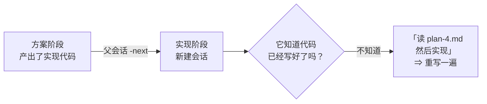
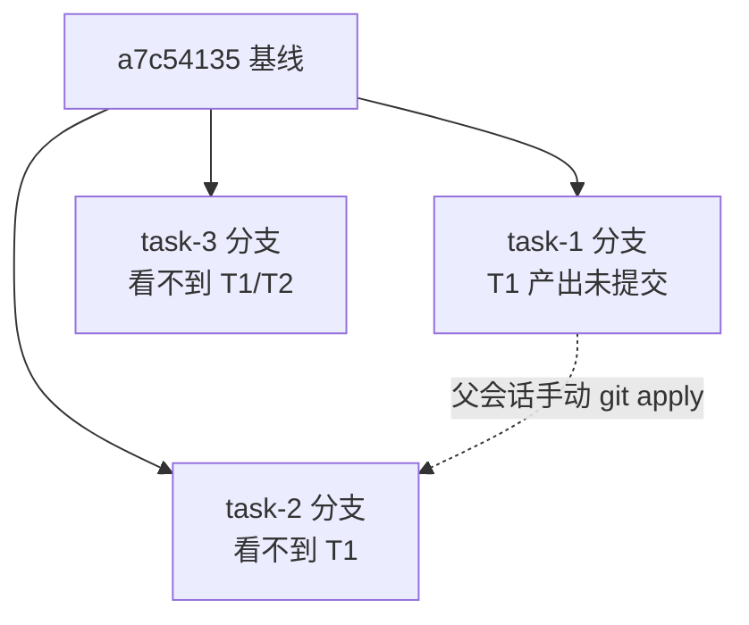

# MindFS 任务看板 / 任务模板 / 任务组编排 —— 源码机制考证

> 本文所有结论均以 **fork 当前主干（`02cdf7b` Merge tag 'v0.5.3' 之后）** 的源码为依据，逐条给出 `文件:行号` 与代码片段。
> 标注约定：
> - 「**源码确证**」= 直接读到的代码逻辑，或本机实机验证的结果；
> - 「**【推测】**」= 源码未直接写明、由代码行为反推的判断，需进一步实测。
>
> 调研范围：`server/internal/kanban/`、`server/internal/api/`、`web/src/components/TaskGroupPanel.tsx`、`web/src/components/TaskTemplateDialog.tsx`、`web/src/App.tsx`、`cli/cmd/`。

---

## 0. 系统总览与数据落盘

三层结构（**源码确证**）：

| 层 | 载体 | 存储位置 |
|---|---|---|
| 任务模板 / 阶段模板 | `TaskTemplate` / `StageTemplate`（JSON 文件） | `<userConfig>/mindfs/task_template.json`（`template_store.go:20`，`configpkg.MindFSConfigDir()`） |
| 任务实例 / 任务组 / 依赖 / 消息 | `tasks` / `task_groups` / `task_dependencies` / `task_events`（SQLite） | `<root>/.mindfs/tasks/task-kanban.db`（`task_store.go:19` `taskDBMetaPath = "tasks/task-kanban.db"`，`task_store.go:49-55`） |
| 依赖关系 | 表 `task_dependencies(task_id, depends_on)` | `orchestration_store.go:27-29` |

关键点：**执行状态按 rootID 分库**。

```go
// server/internal/kanban/task_store.go:49-55
func taskDBPath(root fs.RootInfo) (string, error) {
	meta, err := root.EnsureMetaDir()
	if err != nil {
		return "", err
	}
	return filepath.Join(meta, filepath.FromSlash(taskDBMetaPath)), nil
}
```

`Service.taskStore(rootID)` 对每个 root 惰性建一个 `*TaskStore` 并缓存（`service.go:1319-1352`），首次打开时执行 `store.recoverManaged()`（`service.go:1346`）——即**进程重启会把所有「已 admit 但未结束」的组内任务标为 fail**（见 §B.9）。

三层的关系（**源码确证**）：

```
TaskGroup  --1:N-->  Task  --1:N-->  StageRun
   |                    |
   |                    +-- depends_on --> 其它同组 Task（仅同组，禁止跨组）
   +-- TaskGroup.SessionKey --> 一个普通 chat 会话（父会话）
```

`TaskGroup` 自身**不执行任何东西**，它只承载编排状态与父会话指针：

```go
// server/internal/kanban/groups.go:12-26
// TaskGroup owns orchestration state, not an execution task or a hidden session.
type TaskGroup struct {
	ID             string
	RootID         string
	SessionKey     string   // 父会话（普通 chat session）
	Title          string
	ProjectContext string   // 共享上下文，注入每个子任务 prompt
	Published      bool
	PlanVersion    int
	Status         string
	BlockReason    string
	...
}
```

---

## A. 模板与阶段

### A1. `StageTemplate` / `TaskTemplate` 全部字段的语义与默认值

**源码确证** —— 结构定义（`types.go:35-67`）：

```go
// server/internal/kanban/types.go:35-50
type StageTemplate struct {
	ID                 string
	Name               string
	Role               string    // "user" | "agent"
	AutoAdvance        bool      // 见 A3
	Agent              string    // role=agent 时必填
	Model              string
	Mode               string    // agent 的 mode（如 codex 的 approval mode）
	Effort             string    // 思考强度
	FastService        string    // "on" | "off" | ""
	PlanMode           bool
	SessionReusePolicy string    // "task_main" | "same_stage" | "always_new"
	PromptTemplate     string
	CreatedAt          time.Time
	UpdatedAt          time.Time
}
```

```go
// server/internal/kanban/types.go:52-67
type TaskTemplateStage struct {
	ID              string        // 该 stage 在模板内的行 ID
	StageTemplateID string        // 引用的可复用阶段模板 ID（可空）
	Position        int           // 排序键，保存时被重排为下标
	Snapshot        StageTemplate // 完整快照（不随 StageTemplate 变化而变）
}
type TaskTemplate struct {
	ID             string
	Name           string
	Description    string          // 有字段、无 UI 编辑入口（见 E2）
	MaxConcurrency int             // <=0 会被改成 1
	Stages         []TaskTemplateStage
	...
}
```

默认值/归一化（**源码确证**）：

| 字段 | 默认 | 位置 |
|---|---|---|
| `StageTemplate.Role` | 空 → `"user"` | `template_store.go:361-363` |
| `StageTemplate.SessionReusePolicy` | 空 → `"task_main"` | `template_store.go:370-372` |
| 其它字符串字段 | `TrimSpace` | `template_store.go:358-373` |
| `TaskTemplate.MaxConcurrency` | `<=0` → `1` | `template_store.go:193-195` |
| `TaskTemplateStage.ID` | 空 → `newID("tmpl_stage")` | `template_store.go:182-184` |
| `TaskTemplateStage.Position` | 重排为切片下标 | `template_store.go:185` |
| `Task.CreatedAt` 等 | 服务端时间 | `service.go:223-248` |
| `Task.Status` | 独立任务 `waiting_user`；组内任务 `pending`；独立且首阶段 `auto_advance` → `queued` | `service.go:227-233` |

前端新建模板的默认值（**源码确证**，`TaskTemplateDialog.tsx:26-52`）：`max_concurrency: 2`；user 阶段 `auto_advance:false`、空 prompt；agent 阶段 `agent:"codex"`、`session_reuse_policy:"task_main"`、`prompt_template:"{previous_input}"`、`auto_advance:false`。

> 注意 `StageTemplateID` 只影响 **UI 上的来源标记与「另存为模板」**，执行时一律读 `Snapshot`（`service.go:924` `stage := tmpl.Stages[...].Snapshot`）。所以改阶段模板**不会**影响已存在的任务模板。

### A2. `prompt_template` 的全部占位符

**源码确证** —— 只有一个替换函数、一个值字典：

```go
// server/internal/kanban/service.go:1372-1378
func BuildAgentPrompt(template string, values map[string]string) string {
	out := template
	for key, value := range values {
		out = strings.ReplaceAll(out, "{"+key+"}", value)
	}
	return out
}
```

```go
// server/internal/kanban/service.go:1084-1100
func (s *Service) promptValues(ctx context.Context, store *TaskStore, task Task, tmpl TaskTemplate, stage StageTemplate, run StageRun) map[string]string {
	previousInput := strings.TrimSpace(run.Input)
	if previousInput == "" && run.StageIndex > 0 {
		if previous, err := store.LatestStageRun(ctx, task.ID, run.StageIndex-1); err == nil {
			previousInput = previous.Input
		}
	}
	initialInput := previousInput
	if first, err := store.LatestStageRun(ctx, task.ID, 0); err == nil {
		initialInput = first.Input
	}
	return map[string]string{
		"previous_input":     previousInput,
		"task_initial_input": initialInput,
		"task_number":        strconv.Itoa(task.TaskNumber),
	}
}
```

所以占位符**只有三个**：

| 占位符 | 取值来源 | 边界 |
|---|---|---|
| `{previous_input}` | **本 run 的 `Input`**；为空且非首阶段时回落取**上一阶段 run 的 `Input`** | 详见 A10 §B.10 |
| `{task_initial_input}` | **阶段 0 的 run 的 `Input`**（即创建任务时用户填的 input；组内任务经 `advanceManagedStage` 可能被覆盖，见 B8） | `LatestStageRun(task.ID, 0)` 失败则退化为 `previousInput` |
| `{task_number}` | `task.TaskNumber`（进程内递增编号，`task_store.go:260-266`） | — |

**未识别的占位符原样保留**（不报错），有测试固化该行为：

```go
// server/internal/kanban/service_test.go:841-844
legacy := BuildAgentPrompt("Root: {root_id}", values)
if legacy != "Root: {root_id}" {
	t.Fatalf("legacy placeholder was replaced: %q", legacy)
}
```

**特别注意 `StageRun.Input` 与 `StageRun.Result` 的区别**（这是最容易搞错的一处）：

```go
// server/internal/kanban/types.go:117-134
type StageRun struct {
	Trigger string  // 建 run 的来源；"events" = 由消息/事件重入创建
	Result  string  // 交付结果：仅由 from-task completed:true 的 message 写入
	...
	Input   string  // 本阶段「要做什么」的文本
	RenderedPrompt string // 实际发给 agent 的完整 prompt（含附加区块）
	...
}
```

- `Input`：人/上游**下达给本阶段的要求**。来源见 §B.8。
- `Result`：本阶段**交付的结论**。只在 `finishManagedRun` 里被写：

```go
// server/internal/kanban/orchestration_execution.go:392-397
if action == "complete" {
	run.Result = message          // message 来自 from-task completed:true 的 message
	if t.CurrentStageIndex < len(tmpl.Stages)-1 {
		action = "stage_done"
	}
}
```

两者**互不赋值**。`{previous_input}` 用的是 `Input`，**永远拿不到 `Result`**；`Result` 只出现在任务组的两条路径上：① 注入下游任务 prompt 的「## 前置任务」区块（§C13）；② `GET /api/tasks/{id}/read/result`（`http_task_orchestration.go:105-112`）。

### A3. `auto_advance` 的确切语义

**结论（源码确证）：作用于「刚完成的那个阶段」，不是「将进入的阶段」。**

agent 阶段（任务组路径）：

```go
// server/internal/kanban/orchestration_execution.go:456-460
if action == "stage_done" && tmpl.Stages[t.CurrentStageIndex].Snapshot.AutoAdvance {
	if e = advanceManagedStage(ctx, tx, &t, tmpl, message); e != nil {
		return e
	}
}
```

`t.CurrentStageIndex` 此刻仍是**刚完成阶段**的索引（`advanceManagedStage` 内部才 +1）。独立任务路径同样用刚完成的阶段：

```go
// server/internal/kanban/service.go:946-958
if run.Status == StageStatusSuccess {
	if stage.AutoAdvance {
		if task.CurrentStageIndex == len(tmpl.Stages)-1 {
			return s.finishTask(ctx, store, task, StatusSuccess, "completed", "")
		}
		detail, err := s.moveTo(ctx, store, task, tmpl, task.CurrentStageIndex+1, "auto_advanced", "", "")
		...
	}
	return s.waitForUser(ctx, store, task, run, "agent_stage_done")
}
```
（`stage` 来自 `service.go:924` `stage := tmpl.Stages[task.CurrentStageIndex].Snapshot`）

效果对照：

| 刚完成阶段 | `auto_advance` | 结果 |
|---|---|---|
| agent | `true` | 直接进入下一阶段；若是最后阶段则任务 `success` |
| agent | `false` | `task.Status = waiting_user`，等用户点 Next / 组内等父会话 |
| user | `true`（**阶段 0，独立任务**） | 创建时即 `status=queued`、`run.status=approved`，调度器直接开跑（`service.go:231-233`、`service.go:260-263`） |
| user | `true`（**非阶段 0，或组内任务**） | **与 `false` 完全相同**——见下 |
| user | `false` | 进 `waiting_user` 等用户输入 |

user 阶段（非阶段 0）为何无效（**源码确证**）：`moveTo` 只在 `Role==user 且 !AutoAdvance` 时把新 run 置为 `waiting_user`；`auto_advance=true` 时新 run 留在 `pending`：

```go
// server/internal/kanban/service.go:1259-1261
if stage.Role == RoleUser && !stage.AutoAdvance {
	run.Status = StageStatusWaitingUser
}
```

而 `executeTask` 的 user 分支只认 `approved`/`success` 才前进，`pending` 仍走 `waitForUser`：

```go
// server/internal/kanban/service.go:929-941
if stage.Role == RoleUser {
	if run.Status == StageStatusApproved || run.Status == StageStatusSuccess {
		... moveTo(next) ...
	}
	return s.waitForUser(ctx, store, task, run, "user_input_required")
}
```

**推论（源码确证）**：user 阶段的「完成」动作本身就是用户点 Next（那时已经前进了一次），所以 `auto_advance` 对 user 阶段没有额外的可跳过环节；除阶段 0 的「创建即开跑」特例外，它是**空操作**。fork 新增的回归测试固化了 agent 侧的语义：

```go
// server/internal/kanban/auto_advance_semantics_test.go:8-11
// TestAutoAdvanceOnAgentStageSkipsWaitingUser 验证 auto_advance 的确切语义。
// 它作用于「刚完成的那个阶段」：
//   - true  → agent 交付后自动推进到下一阶段（该阶段不产生人工关卡）
//   - false → 停下，任务进入 waiting_user 等用户推进
```

### A4. `session_reuse_policy` 三值的决策逻辑与优先级

**源码确证** —— 决策函数是 `AppContext.EnsureAgentSession`（`appcontext.go:306-359`），任务编排侧的 resolve 就这一个，没有第二处：

```go
// server/internal/api/appcontext.go:311-330
reusable := func(key string) bool {
	if strings.TrimSpace(key) == "" {
		return false
	}
	existing, err := uc.GetSession(ctx, usecase.GetSessionInput{RootID: exec.RootID, Key: key})
	return err == nil && existing != nil
}
if reusable(exec.Run.SessionKey) && exec.Stage.SessionReusePolicy != kanban.SessionReuseAlwaysNew {
	return strings.TrimSpace(exec.Run.SessionKey), nil       // ① 最高优先级
}
switch strings.TrimSpace(exec.Stage.SessionReusePolicy) {
case kanban.SessionReuseTaskMain, "":
	if reusable(exec.Task.MainSessionKey) {
		return strings.TrimSpace(exec.Task.MainSessionKey), nil  // ② task_main
	}
case kanban.SessionReuseSameStage:
	if reusable(exec.Run.SessionKey) {
		return strings.TrimSpace(exec.Run.SessionKey), nil       // ③ same_stage
	}
}
// ④ 兜底：新建会话
```

优先级与语义：

| 顺序 | 条件 | 结果 |
|---|---|---|
| ① | `exec.Run.SessionKey` 指向的会话存在，**且 policy != `always_new`** | 复用该 run 的会话（**对三种 policy 中除 `always_new` 外都生效**，因其在 switch 之前） |
| ② | policy ∈ {`task_main`, 空} 且 `task.MainSessionKey` 可用 | 复用任务主会话 |
| ③ | policy == `same_stage` 且 `run.SessionKey` 可用 | 复用本阶段会话（与 ① 等价，① 已覆盖） |
| ④ | 以上都不成立 | 新建 chat 会话，命名 `<模板名> / #<任务编号>`（`appcontext.go:331-339`） |

`task.MainSessionKey` 的回写规则（**源码确证**）：只有 `policy` 为空或 `task_main` 且尚无主会话时才写：

```go
// server/internal/kanban/service.go:998-1000 （独立任务路径）
if (strings.TrimSpace(stage.SessionReusePolicy) == "" || stage.SessionReusePolicy == SessionReuseTaskMain) && strings.TrimSpace(task.MainSessionKey) == "" {
	task.MainSessionKey = sessionKey
}
```

**易错点**：`always_new` 并不会「每次都新建」——只要 `run.SessionKey` 已经存在（同一 run 重入，例如发消息重跑），① 的守卫被 `!= always_new` 挡住后落到 ④ **新建**。所以 `always_new` 的语义是「同一阶段内也不复用旧会话」。而 `same_stage` 与 `task_main` 在 **run.SessionKey 已存在时行为相同**，差异只在新建阶段时（`same_stage` 拿不到旧 key 就新建，不走 task 主会话）。

`RunGroupTurn`（父会话轮次）**不使用**该策略，直接复用 `g.SessionKey`（`server/internal/api/task_group_runner.go:43`）。

### A5. `role:user` 与 `role:agent` 的 `prompt_template` 语义是否不同

**结论（源码确证）：后端语义完全不同——`user` 阶段的 `prompt_template` 后端从不使用。**

- 后端只在 agent 执行路径调用 `BuildAgentPrompt`：`service.go:985`（独立任务）、`orchestration_execution.go:270`（组内任务）。两处之前都有 `stage.Role != RoleAgent` 的早退（`service.go:943-945`）。
- `user` 阶段的 `prompt_template` **唯一**用途是前端创建任务时预填输入框：

```tsx
// web/src/App.tsx:241-244
function firstUserInputTemplate(template: TaskTemplate | null): string {
  const first = template?.stages?.[0]?.snapshot;
  return first?.role === "user" ? first.prompt_template || "" : "";
}
// web/src/App.tsx:2161
const initialText = firstUserInputTemplate(template);
```

- 前端的 label 也据此区分（`TaskTemplateDialog.tsx:440-468`：agent →「prompt_template / 阶段开始时提交给 Agent」；user →「用户输入模板 / 创建任务时预填到输入框」）：

```ts
// web/src/i18n/locales/zh-CN.ts:374-376
"taskTemplate.promptTemplateInfo": "阶段开始时提交给 Agent，可用 {previous_input}、{task_initial_input}、{task_number}。",
"taskTemplate.userInputTemplate": "用户输入模板",
"taskTemplate.userInputTemplateInfo": "创建任务时预填到输入框。",
```

**但后端有一处把 user 阶段的 prompt 也读进去做判定**（容易被忽略）：

```go
// server/internal/kanban/service.go:1209 + 1228-1232
if delta > 0 && stageRequiresCurrentInput(tmpl.Stages[target].Snapshot, task.CurrentStageIndex) && strings.TrimSpace(latest.Input) == "" {
	...
}
func stageRequiresCurrentInput(stage StageTemplate, currentStageIndex int) bool {
	prompt := stage.PromptTemplate
	return strings.Contains(prompt, "{previous_input}") ||
		(currentStageIndex == 0 && strings.Contains(prompt, "{task_initial_input}"))
}
```

即：**「目标阶段的 `prompt_template` 里出现 `{previous_input}`」被用来要求「当前阶段必须有 Input」**。所以给 user 阶段的模板写 `{previous_input}` 会意外地变成一道「当前阶段必须有输入才允许前进」的门槛（见 §待确认清单）。

### A6. `SaveTaskTemplate` 的全部校验规则

**源码确证** —— 校验分两层。

`TemplateStore.SaveTaskTemplate`（`template_store.go:154-208`）：

| # | 规则 | 位置 |
|---|---|---|
| 1 | `name` 必填（trim 后非空） | `164-165` |
| 2 | `stages` 非空 | `166-168` |
| 3 | 按 `Position` 稳定排序后再判：**第一个阶段必须 `role == user`** | `169-172` |
| 4 | 每个 `role == agent` 的阶段必须有 `agent` | `187-191` |
| 5 | `MaxConcurrency <= 0` → 静默改成 `1`（不报错） | `193-195` |
| 6 | 缺失的 stage/阶段行 ID 自动生成；`Position` 重排为下标 | `181-186` |
| 7 | 每个 `Snapshot` 过 `normalizeStageTemplate` | `186` |

```go
// server/internal/kanban/template_store.go:166-195
if len(in.Stages) == 0 {
	return TaskTemplate{}, errors.New("task template requires stages")
}
sort.SliceStable(in.Stages, func(i, j int) bool { return in.Stages[i].Position < in.Stages[j].Position })
if in.Stages[0].Snapshot.Role != RoleUser {
	return TaskTemplate{}, errors.New("first stage must be user")
}
...
	for i := range in.Stages {
		if in.Stages[i].ID == "" { in.Stages[i].ID = newID("tmpl_stage") }
		in.Stages[i].Position = i
		in.Stages[i].Snapshot = normalizeStageTemplate(in.Stages[i].Snapshot)
		if in.Stages[i].Snapshot.Role == RoleAgent {
			if strings.TrimSpace(in.Stages[i].Snapshot.Agent) == "" {
				return TaskTemplate{}, errors.New("agent stage requires agent")
			}
		}
	}
	if in.MaxConcurrency <= 0 { in.MaxConcurrency = 1 }
```

`StageTemplate` 单独保存时（`template_store.go:64-75`）：name 必填、role ∈ {user, agent}、agent 阶段必须有 agent。

`Service.SaveTaskTemplate` 追加一条**业务**校验（`service.go:117-125` → `141-169`）：「有在途任务时禁止编辑」，唯一豁免是**只改了 `MaxConcurrency`**：

```go
// server/internal/kanban/service.go:150-159
if taskTemplateOnlyConcurrencyChanged(existing, in) {
	return nil
}
count, err := s.countUnfinishedTasksByTemplate(ctx, id)
...
if count > 0 {
	return fmt.Errorf("该模板存在在途任务，编辑前请先完成、取消或删除相关任务")
}
```

在途任务的判定是「状态不属于 success/fail/cancelled」，**跨所有 root 统计**（`service.go:185-205`、`task_store.go:405-420`）。

删除模板同样受此约束，且提示文案不同（`service.go:127-139`：「该模板存在在途任务，删除前请先完成、取消或删除相关任务」）。

另有两条创建期校验（不属于 SaveTaskTemplate 本身，但属同一把关）：
- `service.go:220-222`：`len(tmpl.Stages) == 0 || tmpl.Stages[0].Snapshot.Role != RoleUser` → `"task template first stage must be user"`；
- `orchestration.go:64-73`：每个 agent 阶段过 `Runner.ValidateTaskAgent`（`appcontext.go:1263` 实现）。

---

## B. 任务执行

### B7. 独立任务 vs 任务组任务在 prompt 构造上的完整差异

**独立任务**（`service.go:976-1082` `runAgentStage`）：prompt = **纯模板渲染**，无任何附加区块。

```go
// server/internal/kanban/service.go:984-1004
values := s.promptValues(ctx, store, task, tmpl, stage, run)
prompt := BuildAgentPrompt(stage.PromptTemplate, values)
runtimeRootPath := strings.TrimSpace(task.WorktreePath)
sessionKey, err := s.Runner.EnsureAgentSession(ctx, AgentStageExecution{... Prompt: prompt})
...
run.RenderedPrompt = prompt
```

**任务组任务**（`orchestration_execution.go:203-347` `executeManagedTurn`）：按固定顺序拼接，**完整区块与顺序**如下（源码顺序即注入顺序）：

| 序 | 区块 | 代码 | 条件 |
|---|---|---|---|
| 1 | `BuildAgentPrompt(模板, ...)` 渲染结果 | `270` | 总是 |
| 2 | `\n\n` + 固定工作流指引：`Read mindfs -orchestration for CLI usage. Report with -from-task; set completed: true when the current stage is complete.` | `272-273` | 总是 |
| 3 | `\n\n## 本轮要求\n` + `run.Input` | `274-276` | `run.Input != ""` **且**渲染后的 basePrompt 未包含该 Input |
| 4 | `\n\n## 共享上下文\n` + `group.ProjectContext` | `282-284` | ProjectContext 非空 |
| 5 | `\n\n## 前置任务 <id> (<status>)\n<上游最后一个非空 Result>` | `290-303` | 有依赖；逐个上游一个区块 |
| 6 | `\n\n## 父会话消息\n<消息文本>` | `304-311` | inbox 非空；逐条一个区块 |
| 7 | **可能整体替换**：`taskMessagesPrompt(inbox)` | `322-324` | 见下 |

```go
// server/internal/kanban/orchestration_execution.go:269-311
stage := tmpl.Stages[index].Snapshot
prompt := BuildAgentPrompt(stage.PromptTemplate, s.promptValues(ctx, store, t, tmpl, stage, run))
basePrompt := prompt
workflow := "Read mindfs -orchestration for CLI usage. Report with -from-task; set completed: true when the current stage is complete."
prompt += "\n\n" + workflow
if run.Input != "" && !strings.Contains(basePrompt, run.Input) {
	prompt += "\n\n## 本轮要求\n" + run.Input
}
g, e := store.getGroup(ctx, t.GroupID)
...
if strings.TrimSpace(g.ProjectContext) != "" {
	prompt += "\n\n## 共享上下文\n" + g.ProjectContext
}
deps, e := store.Dependencies(ctx, t.ID)
...
for _, id := range deps {
	d, e := store.GetDetail(ctx, id)
	...
	prompt += "\n\n## 前置任务 " + id + " (" + d.Task.Status + ")\n"
	for i := len(d.StageRuns) - 1; i >= 0; i-- {
		if d.StageRuns[i].Result != "" {
			prompt += d.StageRuns[i].Result
			break
		}
	}
}
inbox, e := store.Inbox(ctx, t.ID)
...
for _, m := range inbox {
	prompt += "\n\n## 父会话消息\n" + taskEventText(m)
}
```

**第 7 条是最容易踩的**——「发消息重跑」时上面 1~6 全部被丢弃，只发消息文本：

```go
// server/internal/kanban/orchestration_execution.go:322-324
if len(inbox) > 0 && (messageTurn || (key == t.MainSessionKey && run.Trigger == "events")) {
	prompt = taskMessagesPrompt(inbox)
}
// server/internal/kanban/task_messages.go:106-112
func taskMessagesPrompt(inbox []TaskEvent) string {
	messages := make([]string, 0, len(inbox))
	for _, event := range inbox {
		messages = append(messages, taskEventText(event))
	}
	return strings.Join(messages, "\n\n")
}
```

前提是 `RunAgentStage` 复用了同一会话（模板、依赖、上下文都已在会话历史里，见 `task_messages.go:105` 的注释：「Existing conversations already contain execution identity and project context.」）。

**两条路径都不会拼进 `root_id` / `task_id`**。任务身份信息由 **session 层**在**会话首轮**注入：

```go
// server/internal/api/usecase/session.go:1110-1116
if in.IsInitial && in.Manager != nil && in.Session != nil {
	prompt += fmt.Sprintf("\n\nMindFS context: root_id=%s session_key=%s", in.Manager.Root().ID, in.Session.Key)
	if in.Session.TaskID != "" {
		prompt += " task_id=" + in.Session.TaskID
	}
	prompt += ". If asked to orchestrate tasks, read mindfs -orchestration; create a task group with this parent session_key, then create ordinary template tasks in that group.\n"
}
```

任务会话在创建时就带上 `TaskID`（`appcontext.go:343-353` 的 `TaskID: exec.Task.ID`），因此**任务 agent 只在首轮看得到自己的 `task_id`**。这与 `orchestration_help.md:196` 的说法一致（「`<task-id>` … 来自执行提示中的 `task_id`」）。**后续轮次（复用的会话）不再重复注入**（`isInitial` 为 false），这也解释了为什么 `orchestration_test.go:181-185` 断言 kanban 拼出的 prompt 里**不应**出现 `root_id:`/`task_id:`：

```go
// server/internal/kanban/orchestration_test.go:181-185
for _, redundant := range []string{"## MindFS execution", "MindFS task:", "root_id:", "task_id:"} {
	if strings.Contains(exec.Prompt, redundant) {
		t.Errorf("task prompt duplicates session identity: %s", redundant)
	}
}
```

**差异汇总**：

| 维度 | 独立任务 | 任务组任务 |
|---|---|---|
| 模板渲染 | ✅ | ✅ |
| 工作流指引（`-orchestration` / `-from-task`） | ❌ | ✅ |
| `## 本轮要求`（run.Input 补充） | ❌ | ✅ |
| `## 共享上下文`（组 ProjectContext） | ❌ | ✅ |
| `## 前置任务`（上游 Result） | ❌（禁止依赖，`orchestration.go:95-97`） | ✅ |
| `## 父会话消息` | ❌ | ✅ |
| 消息轮整体替换 prompt | ❌（无 inbox 概念） | ✅ |
| MindFS context（root_id/session_key/task_id） | ✅（首轮，session 层） | ✅（首轮，session 层） |

### B8. 阶段推进时下一阶段的 `Input` 来自哪里

**源码确证** —— 两条路径**行为不同**：

**(1) 人工推进（`moveRelative` / `Jump` / `nextManaged` / `publish` 后的首推）→ 下一阶段 `Input` 为空字符串。**

`moveTo` 构造 `StageRun` 时**不设置 `Input`**：

```go
// server/internal/kanban/service.go:1249-1258
run := StageRun{
	ID:         newID("run"),
	TaskID:     task.ID,
	StageIndex: target,
	StageName:  stage.Name,
	Role:       stage.Role,
	Status:     StageStatusPending,
	CreatedAt:  now,
	UpdatedAt:  now,
}
```

`moveRelative` 在推进前只改**当前阶段 run 的状态**，不动 Input：

```go
// server/internal/kanban/service.go:1222-1225
if previousRunStatus != "" {
	_ = store.UpdateStageRunStatus(ctx, latest.ID, previousRunStatus)  // approved / rejected
}
return s.moveTo(ctx, store, task, tmpl, target, eventType, previousRunStatus, in.Reason)
```

因此新阶段的 `Input` 为 `""`（零值），渲染 prompt 时由 `promptValues` 回落到上一阶段的 `Input`（`service.go:1086-1090`）。`in.Reason` 只进入事件的 `payload.reason`，**不进 `Input`**（`service.go:1267`）。

**(2) 自动推进（`advanceManagedStage`，仅任务组）→ 下一阶段 `Input` = 本次交付的 `message`。**

```go
// server/internal/kanban/orchestration_execution.go:540-556
// Complete means the current stage has delivered; only the last stage completes the task.
func advanceManagedStage(ctx context.Context, tx *sql.Tx, t *Task, tmpl TaskTemplate, result string) error {
	index := t.CurrentStageIndex + 1
	if index >= len(tmpl.Stages) {
		return nil
	}
	stage := tmpl.Stages[index].Snapshot
	t.CurrentStageIndex = index
	t.CompletedAt = ""
	t.Status = StatusQueued
	status := StageStatusPending
	if stage.Role == RoleUser {
		t.Status = StatusWaitingUser
		status = StageStatusWaitingUser
	}
	run := StageRun{ID: newID("run"), TaskID: t.ID, StageIndex: index, StageName: stage.Name, Role: stage.Role, Status: status, Input: result, CreatedAt: t.UpdatedAt, UpdatedAt: t.UpdatedAt}
	return insertStageRun(ctx, tx, run)
}
```

其中 `result` 就是 `from-task completed:true` 的 message：

```go
// server/internal/kanban/orchestration_execution.go:456-458（调用点）
if action == "stage_done" && tmpl.Stages[t.CurrentStageIndex].Snapshot.AutoAdvance {
	if e = advanceManagedStage(ctx, tx, &t, tmpl, message); e != nil {
```

**(3) 用户在阶段内改输入**：`UpdateCurrentInput` → `UpdateStageRunInput(run.ID, input)`（`service.go:360-362`）；组内路径转发到 `PatchTask`（`service.go:307-309`），后者直接 `UPDATE stage_runs SET input=? WHERE task_id=? AND stage_index=0`（`orchestration.go:226-231`）——**注意只改阶段 0**。

**(4) 独立任务创建时**：阶段 0 的 `Input` = `CreateTaskInput.Input`（`service.go:256`）。

### B9. 任务完整状态机

**源码确证** —— 状态常量：

```go
// server/internal/kanban/types.go:12-32
StatusPending     = "pending"
StatusQueued      = "queued"
StatusRunning     = "running"
StatusWaitingUser = "waiting_user"
StatusPaused      = "paused"
StatusSuccess     = "success"
StatusFail        = "fail"
StatusCancelled   = "cancelled"

StageStatusPending/ Running / WaitingUser / Success / Fail / Cancelled / Approved / Rejected
```

终态定义（`task_store.go:733-740`）：`success` / `fail` / `cancelled`。

**Task 状态转换表**：

| 起点 | 条件 | 终点 | 位置 |
|---|---|---|---|
| （创建）独立任务 | 首阶段非 auto_advance | `waiting_user` | `service.go:227` |
| （创建）独立任务 | 首阶段 auto_advance | `queued` | `service.go:231-233` |
| （创建）组内任务 | 总是 | `pending` | `service.go:229-230` |
| `pending`（组内） | `managedReady`（已发布 + 组 active/coordinating + 依赖全部 success） | `queued` | `orchestration_execution.go:188-196` |
| `queued` | `hasSlot` + `TaskExecutionTemplate` 成功 + `admitTask` | `running`（`SchedulerAdmitted=true`） | `service.go:778-787`、`service.go:821-850` |
| `queued` | 用户 `-run-now`（`RunNow`） | `running`（**跳过并发限制**，仍检查 ready） | `service.go:398-447` |
| `running` | agent 阶段交付完成、非末阶段、`auto_advance=false` | `waiting_user` | `service.go:958`、`orchestration_execution.go:421-422` |
| `running` | agent 阶段交付完成、末阶段 | `success` | `service.go:946-950`、`orchestration_execution.go:431-435` |
| `running` | 执行出错 | `fail` + `BlockReason=err` | `orchestration_execution.go:438-441`、`service.go:1033-1035`（独立任务用 `waiting_user`+`SessionError`，见下） |
| `running` | 执行中收到新消息 | `pending`（有主会话则 `waiting_user`） | `orchestration_execution.go:423-430` |
| `waiting_user` | 用户 `next` | 下一阶段（`queued`/`running`/`waiting_user`） | `service.go:386-396`、`service.go:1234-1247` |
| `waiting_user` | 用户 `complete`（须在末阶段） | `success` | `service.go:527-560` |
| `paused` | `-resume` | `running`（已 admit）或 `queued` | `service.go:485-507` |
| 任意非终态 | `-cancel` | `cancelled`（`SchedulerAdmitted=false`） | `service.go:516-525` |
| 任意非终态 | `-fail` | `fail` | `service.go:509-514` |
| 进程重启 | `recoverManaged`：`SchedulerAdmitted=true` 的组内任务 | `fail` + `BlockReason="execution_interrupted: …"` | `recovery.go:28-60` |

独立任务的执行错误是**特例**（不算 fail，而是留在原地等用户）：

```go
// server/internal/kanban/service.go:1029-1051
if err := runErr; err != nil {
	...
	task.Status = StatusWaitingUser
	task.AuxFlags.SessionError = message
	run.Status = StageStatusFail
	...
	return errStopTaskExecution
}
```

**StageRun 状态转换**（`moveTo` 建 `pending`/`waiting_user`，`runAgentStage` 置 `running`→`success`/`fail`，`moveRelative` 把上一阶段置 `approved`/`rejected`）：
`pending` → `running` → `success`/`fail`/`waiting_user`；人工推进时 `waiting_user`/`fail` → `approved`（next）或 `rejected`（prev）。`success`/`fail` 同时也算可推进（`service.go:930`、`service.go:946`）。

`TaskAuxFlags`（`types.go:101-107`）是 UI 徽标用的旁路信息：`ask_user_waiting` / `has_plan` / `has_todos` / `has_task` / `session_error`，由 stream 事件回写（`appcontext.go:1030-1075`）。

### B10.【关键】自动推进链路中 `{previous_input}` 到底拿到什么

**源码确证。结论：拿到的是「刚完成阶段交付时写入下一阶段 `Input` 的那段交付消息全文」，也就是 `run.Result` 的同值文本；若该 `Input` 为空则回落到上一阶段的 `Input`。**

链路逐步：

1. agent 发 `-from-task` 且 `completed: true`，message = M。
2. `finishManagedRun` 把它写进 `run.Result`（并保留 `action="complete"` 时 `message=M`）：

```go
// server/internal/kanban/orchestration_execution.go:379-397
if ev.Type == "from-task" && action != "cancel" {
	var report taskReport
	if json.Unmarshal([]byte(ev.Payload), &report) == nil && report.ExecutionID == run.ID && report.Completed {
		action = "complete"
		intent = report.ManagedInput
		message = report.Message
	}
}
...
if action == "complete" {
	run.Result = message
	if t.CurrentStageIndex < len(tmpl.Stages)-1 {
		action = "stage_done"
	}
}
```

3. 若刚完成阶段 `AutoAdvance=true`，事务内 `advanceManagedStage(..., message)` 把 **M 写进下一阶段的 `Input`**（`orchestration_execution.go:456-460` + `554`）。
4. 下一阶段跑 agent 时 `promptValues` 取 `run.Input`：

```go
// server/internal/kanban/service.go:1085-1090
previousInput := strings.TrimSpace(run.Input)
if previousInput == "" && run.StageIndex > 0 {
	if previous, err := store.LatestStageRun(ctx, task.ID, run.StageIndex-1); err == nil {
		previousInput = previous.Input
	}
}
```

5. 于是 `{previous_input}` = **本阶段 `Input`**（= 上游交付 M），**或**在 `Input` 为空时 = **上一阶段的 `Input`**（不是上一阶段的 `Result`）。

**实机佐证**（本机 `mindfs` root，任务 `#5`：
模板「蓝图」= 需求(user) → 方案(agent, auto_advance) → 审核(user) → 实现(agent, auto_advance) → 验收(agent)）：

- 阶段 1（方案）的 `rendered_prompt` 里 `{previous_input}` 被替换为**用户在阶段 0 填的需求文本**；
- 阶段 1 的 `run.input` 为 **null**（人工推进，见 B8）；
- 阶段 1 的 `run.result` = 方案的交付说明全文；
- 阶段 3（实现）此时 `{previous_input}` 应为阶段 2 的 `Input`——因阶段 2 也是人工推进，其 `Input` 为空，故**回落到阶段 1 的 `Input`（空）→ 再回落到阶段 0 的需求文本**。

**【已实测更正，见 `blueprint_chain_test.go`】** 原推测「用户没写审核意见时实现阶段会拿到原始需求」**不成立**。
实测链路（`TestBlueprintTemplateChain`）捕获的各阶段实际 prompt：

```
阶段 1 (方案):   design DEMAND_原始需求        ← 拿到需求
阶段 3 (实现):   implement PLAN_方案全文_MARKER ← ★ 拿到方案全文
阶段 4 (验收):   verify IMPL_实现交付_MARKER    ← 拿到实现交付说明
```

原因：方案阶段 `auto_advance=true`，交付时 `advanceManagedStage` 把交付 message（方案全文）
写进**下一阶段（审核）的 `Input`**。因此即使审核阶段用户不写内容，
实现阶段的 `{previous_input}` 回落到审核阶段的 `Input` 仍是**方案全文**。

**关键前提**：产生交付的那个 agent 阶段**必须 `auto_advance=true`**，否则走人工推进路径
（`moveTo` 建的 run `Input` 恒为空），此时才会出现「回落到更早输入」的退化。
「蓝图」模板已满足该前提（阶段 1、3 均为 `auto_advance=true`）。

**仍未覆盖的场景**：`auto_advance=false` 的多阶段模板（靠人工逐步推进）——
此时下游 `{previous_input}` 确实会回落到更早的人工输入，方案正文不可达。这是该配置下的固有限制。

**【2026-09-30 实机更正与补全】** 上段的「回落到更早的人工输入」表述**不准确**，实际规律更简单也更危险：

> **`{previous_input}` 取的值 = 「上一阶段 `Input` 字段当前的内容」，而 `Input` 是单字段、可被用户写入覆写。
> 因此下游拿到的是「谁最后写了那个 `Input`」，既可能是上游交付，也可能是**用户在该阶段填的审核意见**。**

实测证据（任务组 `group_933ca20bdac2911f` / 任务 `#7`，蓝图模板原样，五阶段完整链路）：

| stage | 名称 | 角色 | 状态 | 会话 | input | result | rendered_prompt |
|---|---|---|---|---|---|---|---|
| 0 | 需求 | user | waiting_user | — | 290 | 0 | 0 |
| 1 | 方案 | agent | success | `...29378` | 0 | **1810** | 464 |
| 2 | 审核 | user | waiting_user | — | **276** | 0 | 0 |
| 3 | 实现 | agent | success | `...29378` | 0 | **2612** | 1042 |
| 4 | 验收 | agent | success | `...db70b` | 2612 | **2952** | 3317 |

关键过程：

1. 方案阶段（`auto_advance=true`）交付 1810 字方案 → `advanceManagedStage` 把交付正文写入**审核阶段的 `Input`**（1810 字，与 `stage1.result` 逐字节相同）
2. **用户向审核阶段写入 276 字审阅意见** → 经 `POST /api/tasks/{id}/input` → `UpdateStageRunInput` → `UPDATE stage_runs SET input=?`，**整体替换**，1810 → 276
3. `-next` 推进到实现阶段，其 `rendered_prompt` 的 `## 方案` 段落 = **276 字审阅意见**；
   检索方案原文特征串（「经 -from-task 消息正文提交报告」「基准数据表」）**均为 False**

**结论修正**：`auto_advance=false` 本身不是问题所在，**真正的风险是「用户与上游交付抢同一个 `Input` 字段」**。
即使前序 agent 阶段 `auto_advance=true`（蓝图即如此），只要中间夹一个会被用户写内容的 user 阶段，
**上游交付就会被静默覆盖**——而蓝图模板的实现阶段 prompt 明明写着 `## 方案 {previous_input}`，
预期「按已批准的方案实现」，实际却拿不到方案。

**配套**：`docs/blueprint-template-requirements.md` §五 Q4 与 §七 记录了同一结论。
**根治方向**：让 `promptValues` 在 `Input` 为空时回落到上一阶段的 `Result`，或不要让用户内容与交付共用 `Input` 字段。

**已被测试固化的部分**：`upstream_result_injection_test.go` 验证的是**任务组**场景（上游任务 → 下游任务），走的是 `## 前置任务` 里的 `Result`，与 `{previous_input}` 是两条独立通路：

```go
// server/internal/kanban/upstream_result_injection_test.go:79-84
if !strings.Contains(captured, upstreamResult) {
	t.Error("上游交付内容未注入下游 prompt —— 任务组无法传递结果")
}
if !strings.Contains(captured, "## 前置任务") {
	t.Error("缺少「## 前置任务」区块")
}
```

---

## C. 任务组

### C11. `TaskGroup` 字段与状态机

字段见 §0（`groups.go:12-26`）。状态取值与转换（**源码确证**）：

| 状态 | 进入条件 | 位置 |
|---|---|---|
| `active` | `CreateGroup` 初始值；`resume`；追加任务重开（`success`→`active`）；一轮父会话 turn 成功收尾 | `groups.go:109`、`240-241`、`419-421`、`446` |
| `coordinating` | `refreshGroups` 决定处理 inbox 时（把消息绑定到本 turn） | `groups.go:346-348` |
| `blocked` | 父会话 turn 返回错误；或进程重启时残留 `coordinating` | `groups.go:414-418`、`recovery.go:30` |
| `paused` | `GroupAction("pause")` | `groups.go:237-238` |
| `success` | `GroupAction("complete")` 且 `groupAcceptable` 通过 | `groups.go:247-259` |
| `cancelled` | `GroupAction("cancel")`（并级联取消未完成任务） | `groups.go:242-246`、`182-198` |

`success` / `cancelled` 为终态，终态直接拒绝操作：

```go
// server/internal/kanban/groups.go:215-217
if g.Status == "success" || g.Status == "cancelled" {
	return g, errors.New("group is terminal")
}
```

`complete` 的两道硬门槛（**源码确证**）：

```go
// server/internal/kanban/groups.go:170-181
func groupAcceptable(graph GroupGraph) error {
	if !graph.Group.Published || len(graph.Tasks) == 0 {
		return errors.New("published nonempty group required")
	}
	for _, d := range graph.Tasks {
		t := d.Task
		if t.Status != StatusCancelled && (!t.Published || t.Status != StatusSuccess || t.BlockReason != "" || t.SchedulerAdmitted) {
			return fmt.Errorf("task #%d is not effectively complete", t.TaskNumber)
		}
	}
	return nil
}
// groups.go:254-258
for _, m := range graph.Messages {
	if m.StageRunID == "" || g.Status != "coordinating" {
		return g, errors.New("group messages are awaiting automatic processing; wait for delivery to the parent conversation")
	}
}
```

即：**组内每个未取消任务都必须 `published && success && 无 block_reason && 未占用调度位`，且不得有未处理的 inbox 消息。**

`PlanVersion` 的递增点（乐观并发控制）：追加任务（`plan.go:104` → `appendToGroup` → `bumpGroup`）、创建单个子任务（`task_store.go:279`）、`PatchTask` / `DeleteTask`（`orchestration.go:237`、`288`）、`to-task`（`orchestration_execution.go:144-147`）、修改共享上下文（`groups.go:489`）。`publish` / `approve-plan` / `complete` 都必须带**当前** `plan_version`，否则报错：

```go
// server/internal/kanban/groups.go:222-224
if in.PlanVersion == nil || *in.PlanVersion != g.PlanVersion {
	return g, errors.New("current plan_version required")
}
```

### C12. 依赖 DAG：存储、环检测、下游解锁

**存储**（源码确证）：`task_dependencies(task_id, depends_on)`，主键 (task_id, depends_on)，DB 级自环约束 `CHECK(task_id <> depends_on)`：

```sql
-- server/internal/kanban/orchestration_store.go:27-30
CREATE TABLE IF NOT EXISTS task_dependencies (
 task_id TEXT NOT NULL, depends_on TEXT NOT NULL, PRIMARY KEY(task_id, depends_on), CHECK(task_id <> depends_on));
CREATE INDEX IF NOT EXISTS idx_dependencies_upstream ON task_dependencies(depends_on);
```

**环检测**（源码确证）：`ValidateDAG` 是带路径回溯的 DFS，报出**具体环**；同时检测重复依赖与「依赖不在本组」：

```go
// server/internal/kanban/orchestration_store.go:69-112（节选）
if state[id] == 1 {
	start := 0
	for i, v := range path { if v == id { start = i; break } }
	return fmt.Errorf("dependency cycle: %s", strings.Join(append(append([]string{}, path[start:]...), id), " -> "))
}
...
	for _, dep := range edges[id] {
		if seen[dep] { return fmt.Errorf("duplicate dependency: %s", dep) }
		seen[dep] = true
		if _, ok := edges[dep]; !ok { return fmt.Errorf("dependency %s is outside this task group", dep) }
```

调用点：
- 批量建图：`plan.go:76`（构造完 edges 后统一校验）；
- 单建：`orchestration.go:103-106`（把新任务挂成 `__new__` 再校验）；
- 改依赖：`orchestration.go:161-164`；
- 发布/批准：`groups.go:228`。

**下游解锁触发**（源码确证）：唯一的判定函数是 `managedReady`，由 `refreshManaged` 把 `pending` 提升为 `queued`：

```go
// server/internal/kanban/orchestration_execution.go:161-197（节选）
func (s *Service) managedReady(ctx context.Context, store *TaskStore, t Task) bool {
	if t.BlockReason != "" && t.BlockReason != "publish_approval" { return false }
	if t.GroupID != "" {
		if !t.Published { return false }
		g, e := store.getGroup(ctx, t.GroupID)
		if e != nil || !g.Published || (g.Status != "active" && g.Status != "coordinating") { return false }
		deps, e := store.Dependencies(ctx, t.ID)
		...
		for _, id := range deps {
			d, e := store.GetTask(ctx, id)
			if e != nil || d.GroupID != t.GroupID || d.Status != StatusSuccess || d.SchedulerAdmitted || d.BlockReason != "" {
				return false
			}
		}
		return true
	}
	return false
}
func (s *Service) refreshManaged(ctx context.Context, store *TaskStore, all []Task) error {
	for _, t := range all {
		if t.GroupID != "" && t.Status == StatusPending && s.managedReady(ctx, store, t) {
			if err := store.UpdateTaskStatus(ctx, t.ID, StatusQueued, nil, false); err != nil { return err }
		}
	}
	return nil
}
```

触发时机：`Service.Schedule(rootID)` 的调度循环每轮都会跑 `refreshGroups` + `refreshManaged`（`service.go:742-747`），而 `Schedule` 会在任务/组状态变化后被调用（`service.go:655` 的 `defer s.Schedule(rootID)`、`service.go:287`、`service.go:392` 等），另有一个 5 秒 ticker 兜底：

```go
// server/internal/kanban/recovery.go:10-22
func (s *Service) Start(ctx context.Context) {
	go func() {
		tick := time.NewTicker(5 * time.Second)
		defer tick.Stop()
		for {
			for _, root := range s.Roots.ListRoots() {
				s.Schedule(root.ID)
			}
			...
```

注意解锁判定里 `d.SchedulerAdmitted` 必须为 false —— 即**上游必须真正退出执行**（`finishManagedRun` 会 `t.SchedulerAdmitted = false`，`orchestration_execution.go:413`）。这有测试固化：

```go
// server/internal/kanban/orchestration_test.go:192-194
if current.Status == StatusSuccess || !current.SchedulerAdmitted || s.managedReady(ctx, store, downstream) {
	t.Error("completion released execution before agent exit")
}
```

### C13.【结果传递】上游任务的什么内容注入下游 prompt

**源码确证**：注入的是**上游 `stage_runs` 中倒序第一条 `Result != ""` 的文本**，位置在 prompt 的 `## 前置任务` 区块（§B7 第 5 条）：

```go
// server/internal/kanban/orchestration_execution.go:290-303
for _, id := range deps {
	d, e := store.GetDetail(ctx, id)
	if e != nil { ... }
	prompt += "\n\n## 前置任务 " + id + " (" + d.Task.Status + ")\n"
	for i := len(d.StageRuns) - 1; i >= 0; i-- {
		if d.StageRuns[i].Result != "" {
			prompt += d.StageRuns[i].Result
			break
		}
	}
}
```

确切格式（按 `deps` 顺序，`deps` 由 SQL `ORDER BY depends_on` 排序，`orchestration_store.go:40`）：

```
\n\n## 前置任务 <上游任务ID> (<上游状态>)\n<上游最后一个非空 Result>
```

- 只传**文本**，不传目录/分支/worktree（见 §D19）；
- 若上游所有 `Result` 都为空，则区块只有标题行、正文为空；
- 文案通过 `GET /api/tasks/{id}/read/result` 也可单独取（同样的「倒序第一条非空 Result」规则，`http_task_orchestration.go:105-112`）。

### C14. `publish` vs `approve-plan`；`localCLIHeaderName` 的 403 逻辑

**两者在 `groupAction` 里是同一个 `case`**（源码确证）：

```go
// server/internal/kanban/groups.go:221-236
case "publish", "approve-plan":
	if in.PlanVersion == nil || *in.PlanVersion != g.PlanVersion {
		return g, errors.New("current plan_version required")
	}
	if len(graph.Tasks) == 0 {
		return g, errors.New("cannot publish empty group")
	}
	if e = ValidateDAG(graph.Edges); e != nil {
		return g, e
	}
	if !g.Published && action == "publish" {
		g.BlockReason = "publish_approval"
	} else {
		g.Published = true
		g.BlockReason = ""
	}
```

区别只在**首次发布**：

| 动作 | 首次（`!g.Published`） | 之后 |
|---|---|---|
| `publish` | 只设 `BlockReason="publish_approval"`，**不置 `Published`** | 同 approve-plan（真正发布） |
| `approve-plan` | **直接置 `Published=true`**、清 BlockReason | 同 publish |

而「真正发布」才触发任务级别的发布与入队：

```go
// server/internal/kanban/groups.go:268-272
if (action == "publish" || action == "approve-plan") && g.Published {
	if _, e = tx.ExecContext(ctx, `UPDATE tasks SET published=1,status=?,updated_at=? WHERE group_id=? AND published=0 AND status NOT IN ('success','cancelled')`, StatusPending, now.Format(time.RFC3339Nano), id); e != nil {
		return g, e
	}
}
```

所以语义是：**`publish`（首次）= 提交计划等用户批准；`approve-plan` = 用户批准，等价于「首发」；首发之后再 `publish` 就是真正的重发布**。`orchestration_help.md:188` 与之吻合（「首次发布后，等待用户在前端确认。确认后…再次发布」）。

**403 逻辑（源码确证）** —— 两层：

HTTP 入口按请求头判定「是不是 CLI 发的 approve-plan」：

```go
// server/internal/api/http_task_groups.go:58-63
func (h *HTTPHandler) handleTaskGroupAction(w http.ResponseWriter, r *http.Request) {
	action := chi.URLParam(r, "operation")
	if action == "approve-plan" && r.Header.Get(localCLIHeaderName) != "" {
		respondError(w, 403, errInvalidRequest("first publication requires user approval"))
		return
	}
```

但真正让 CLI **拿不到本地免鉴权通道**的是路径白名单——`/approve-plan` 被显式排除：

```go
// server/internal/api/http.go:234-240
func isLocalCLIPath(r *http.Request) bool {
	if r == nil || r.URL == nil { return false }
	if strings.HasSuffix(r.URL.Path, "/approve-plan") {
		return false
	}
	...
```

`localCLIHeaderName` 定义在 `http.go:67`（`"X-MindFS-Local-CLI-Token"`），校验函数：

```go
// server/internal/api/http.go:218-232
func (h *HTTPHandler) isLocalCLIRequest(r *http.Request) bool {
	token := strings.TrimSpace(h.LocalCLIToken)
	if token == "" || subtle.ConstantTimeCompare([]byte(strings.TrimSpace(r.Header.Get(localCLIHeaderName))), []byte(token)) != 1 {
		return false
	}
	if !isLocalCLIPath(r) { return false }
	host, _, err := net.SplitHostPort(strings.TrimSpace(r.RemoteAddr))
	...
	ip := net.ParseIP(host)
	return ip != nil && ip.IsLoopback()
}
```

**所以带 CLI token 的 `POST /api/task-groups/{id}/approve-plan` 会 403**，因为：
① `handleTaskGroupAction` 显式判头返回 403（`http_task_groups.go:60`）；
② 即便跳过 ①（例如不带该头），`isLocalCLIPath` 也把它排除，于是 `protectedEndpoint` 落到 E2EE 校验分支，无会话则 401（`http.go:163-177`）。

CLI 侧也确实构造不出这个动作（`task_operations.go:94` 的 `case "plan", "publish", "complete", "pause", "resume", "cancel"` 里**没有** `approve-plan`）。测试固化：

```go
// server/internal/api/http_task_orchestration_test.go:25-36
func TestCLICannotApproveFirstGroupPlan(t *testing.T) {
	r := httptest.NewRequest(http.MethodPost, "/api/task-groups/id/approve-plan", nil)
	r.Header.Set(localCLIHeaderName, "test-cli")
	...
	if w.Code != http.StatusForbidden { t.Fatalf("status=%d", w.Code) }
}
```

### C15. 并发控制：`max_concurrency` 与 `hasSlot`

**源码确证** —— 完整逻辑：

```go
// server/internal/kanban/service.go:795-819
func (s *Service) hasSlot(candidate Task, tmpl TaskTemplate, tasks []Task) bool {
	limit := tmpl.MaxConcurrency
	if limit <= 0 {
		limit = 1
	}
	if !candidate.CreateWorktree {
		limit = 1                 // ← 无 worktree 强制串行
	}
	used := 0
	for _, task := range tasks {
		if task.ID == candidate.ID || !task.SchedulerAdmitted || isTerminalStatus(task.Status) {
			continue
		}
		if !candidate.CreateWorktree {
			if !task.CreateWorktree {   // 统计「同样会占用共享工作区」的任务
				used++
			}
			continue
		}
		if task.CreateWorktree && ((candidate.GroupID != "" && task.GroupID == candidate.GroupID) || (candidate.GroupID == "" && task.GroupID == "" && task.TaskTemplateID == candidate.TaskTemplateID)) {
			used++
		}
	}
	return used < limit
}
```

要点（**源码确证**）：

1. **无 worktree ⇒ 上限恒为 1**：`limit = 1` 覆盖模板的 `MaxConcurrency`。而且统计口径是**全 root 范围内所有无 worktree 的任务**（不分组、不区分模板）——「共享工作区必须串行」。
2. **有 worktree ⇒ 上限 = 模板的 `MaxConcurrency`**，但只在**同组**（或同为独立任务且同一模板）内计数。同一模板用于多个组时互不占额。测试固化：

```go
// server/internal/kanban/groups_test.go:287-305
func TestGroupConcurrencyDoesNotCountOtherGroupsUsingSameTemplate(t *testing.T) {
	template := TaskTemplate{ID: "shared", MaxConcurrency: 1}
	candidate := Task{ID: "candidate", GroupID: "group-a", TaskTemplateID: "shared", CreateWorktree: true}
	other := Task{ID: "other", GroupID: "group-b", TaskTemplateID: "shared", CreateWorktree: true, SchedulerAdmitted: true, Status: StatusRunning}
	if !s.hasSlot(candidate, template, []Task{other}) { t.Fatal("unrelated group consumed candidate concurrency") }
	other.GroupID = "group-a"
	if s.hasSlot(candidate, template, []Task{other}) { t.Fatal("same group exceeded concurrency") }
	candidate.CreateWorktree = false
	other.CreateWorktree = false
	other.GroupID = "group-b"
	if s.hasSlot(candidate, template, []Task{other}) { t.Fatal("shared workspaces must remain serialized across groups") }
}
```

3. **`hasSlot` 只在自动调度路径生效**；`RunNow`（手动启动）**绕过并发**，但仍检查 `managedReady`：

```go
// server/internal/kanban/service.go:398-434（节选）
if task.GroupID != "" {
	if !s.managedReady(ctx, store, task) {
		return TaskDetail{}, errors.New("task cannot start: publication, group state or dependencies are not ready")
	}
}
if task.SchedulerAdmitted { ... }        // 已 admit，直接 RunTask
tmpl, err := s.TaskExecutionTemplate(task)
...
if err := s.admitTask(ctx, store, task, tmpl); err != nil { return TaskDetail{}, err }
```

测试：`groups_test.go:700-763` `TestGroupRunNowBypassesOnlyConcurrency`（「ready despite occupied shared workspace」wantError=false）。

4. 每次调度最多**启动一个**任务，然后 `break` 重跑整个循环（`service.go:759-792`），保证并发判定基于最新状态。

### C16. `-to-task` / `-from-task` 消息链路与 inbox 消费

**发消息**（源码确证，`orchestration_execution.go:26-159` `ManagedAction`）：

| 动作 | `event.TaskID`（"发送者"） | `event.ReceiverTaskID`（inbox 归属） | 副作用 |
|---|---|---|---|
| `-to-task <task>` | 事件默认 `TaskID = <task>`，随后被改成 `owner`（组 ID）→ 视为**父会话发的** | 目标任务 ID | `bumpGroup`（plan_version+1）、**仅当目标任务已 `success` 时**回退到最后一个 agent 阶段、`Status=Pending`（有主会话则 `WaitingUser`）、清 BlockReason/CompletedAt/AuxFlags（`51-84`、`143-147`） |
| `-from-task <task>` | 发送任务 ID | 组 ID（`owner`） | 若 `completed:true` 则 **ReceiverTaskID 置空**、payload 带 `execution_id`（`85-103`） |
| `completed:true` 但当前无执行 | — | — | 报错 `completion requires an active task execution`（`92-94`） |
| `cancel` | — | — | 写 `intent_cancel` 事件；若在执行中则**先把 task 置 cancelled 但不释放调度位**，等执行退出（`104-130`） |

```go
// server/internal/kanban/orchestration_execution.go:85-103（节选）
} else {
	event.ReceiverTaskID = owner
	run, e := store.LatestStageRun(ctx, t.ID, t.CurrentStageIndex)
	if in.Completed {
		if e != nil { return TaskDetail{}, e }
		if t.Status != StatusRunning || run.Status != StageStatusRunning {
			return TaskDetail{}, errors.New("completion requires an active task execution")
		}
		// Delivery is recorded as a message. It only takes effect after
		// successful execution exit; normal deliveries are collected for
		// the final group review rather than waking the parent one by one.
		event.ReceiverTaskID = ""
	}
	if e == nil {
		event.Payload = eventPayload(taskReport{ManagedInput: in, ExecutionID: run.ID})
	}
}
```

`taskReport` 的 `ExecutionID` 是把「报告」绑定到「哪一次执行」的关键（人工不能伪造，注释明确「This is internal metadata, not a CLI parameter」，`orchestration_execution.go:20-24`）。

**【2026-09-30 实机补充】`-to-task` 的实际效果取决于目标阶段角色**（详见「已知坑」第 17 条）：

| 目标阶段角色 | 实际行为 |
|---|---|
| **agent** | 走 `executeManagedTurn(messageTurn=true)`，**重跑一轮**（跳过调度门槛、复用主会话、prompt 整体替换为消息文本） |
| **user** | 只延续对话，**不批准、不重开、不推进阶段**（`task_messages.go:86-87`） |

上表中「重开已 success 的目标任务」的回退逻辑，**仅对已 `success` 的任务生效**
（`t.Status == StatusSuccess` 守卫，`orchestration_execution.go:72-80`）——
停在 `waiting_user` 的任务不会走该回退分支。实测复现：对停在验收阶段（agent，`waiting_user`）的任务
发 `-to-task` 催补交付，成功重跑并补交了 `completed: true`。

**inbox 读取**（源码确证）：

```go
// server/internal/kanban/orchestration_store.go:139-154
func (s *TaskStore) Inbox(ctx context.Context, id string) ([]TaskEvent, error) {
	rows, e := s.db.QueryContext(ctx, `SELECT id, task_id, stage_run_id, type, payload_json, created_at, receiver_task_id, handled_at FROM task_events WHERE receiver_task_id=? AND handled_at='' ORDER BY created_at,id`, id)
	...
```

**消费（任务侧）**（源码确证，`task_messages.go:13-50`）：调度循环每轮调用 `deliverTaskMessages`，只挑「有主会话、未在执行、未占用调度位、且 inbox 中有 `StageRunID == ""` 的新消息」的任务，把它们走一条**不占调度位**的通道：

```go
// server/internal/kanban/task_messages.go:13-50（节选）
// Messages to an existing conversation do not acquire a task scheduler slot.
// RunAgentStage uses the same session send lock as ordinary user messages.
// The task worker guard serializes messages with the task's current execution.
for _, task := range tasks {
	if task.MainSessionKey == "" || task.Status == StatusCancelled { continue }
	...
	if running || task.SchedulerAdmitted { continue }
	inbox, err := store.Inbox(ctx, task.ID)
	...
	fresh := false
	for _, event := range inbox {
		if event.StageRunID == "" { fresh = true; break }
	}
	if !fresh { continue }
	// Also recover replies queued by earlier versions without task admission.
	if task.Status == StatusPending || task.Status == StatusQueued {
		if err := store.UpdateTaskStatus(ctx, task.ID, StatusWaitingUser, nil, false); err != nil { ... }
	}
	s.runTask(task.RootID, task.ID, true)     // messageTurn = true
}
```

消息轮的执行分支：当前阶段是 agent → `executeManagedTurn(..., messageTurn=true)`（prompt 整体替换为消息文本，`orchestration_execution.go:322-324`）；当前阶段是 user → `executeTaskMessages` **只把消息发给此前最后一个 agent 阶段的会话，不批准、不推进**：

```go
// server/internal/kanban/task_messages.go:63-93（节选）
if tmpl.Stages[task.CurrentStageIndex].Snapshot.Role == RoleAgent {
	return s.executeManagedTurn(ctx, store, task, tmpl, true)
}
// A conversation remains reachable at a manual stage, but a message must not
// approve that stage or move the task to another stage.
...
stage := tmpl.Stages[task.CurrentStageIndex].Snapshot
for i := task.CurrentStageIndex - 1; i >= 0; i-- {
	if tmpl.Stages[i].Snapshot.Role == RoleAgent {
		stage = tmpl.Stages[i].Snapshot
		break
	}
}
err = s.Runner.RunAgentStage(ctx, AgentStageExecution{... Run: StageRun{SessionKey: task.MainSessionKey}, Prompt: strings.TrimSpace(prompt)})
```

**消费（组侧）**（源码确证，`groups.go:292-377`）：组 inbox 不在 `deliverTaskMessages` 里；由 `refreshGroups` 处理——若父会话空闲（`!runner.GroupSessionBusy`）且有消息，则把消息 `stage_run_id` 统一改写为本 turn ID（`groups.go:350-362`），拼成 prompt 交给 `RunGroupTurn`：

```go
// server/internal/kanban/groups.go:390-404
prompt := fmt.Sprintf("MindFS task group: root_id=%s group_id=%s plan_version=%d\n", g.RootID, g.ID, g.PlanVersion)
acceptance := false
for _, m := range graph.Messages {
	acceptance = acceptance || m.Type == "acceptance_ready"
	prompt += "\n"
	if m.TaskID != g.ID {
		prompt += "task_id=" + m.TaskID + "\n"
	}
	prompt += taskEventText(m) + "\n"
}
if acceptance {
	for _, d := range graph.Tasks {
		prompt += fmt.Sprintf("\nTask #%d id=%s status=%s", d.Task.TaskNumber, d.Task.ID, d.Task.Status)
	}
}
```

Turn 成功后按 turn ID 标记已处理；失败则保留消息并把组置 `blocked`：

```go
// server/internal/kanban/groups.go:414-431（节选）
if err != nil {
	if current.Status == "coordinating" || current.Status == "active" || current.Status == "success" || current.Status == "paused" {
		current.Status = "blocked"
		current.BlockReason = err.Error()
	}
} else if current.Status == "coordinating" {
	current.Status = "active"
}
...
if err == nil {
	if _, e = tx.Exec(`UPDATE task_events SET handled_at=? WHERE receiver_task_id=? AND stage_run_id=? AND handled_at=''`, now.Format(time.RFC3339Nano), g.ID, turn); e != nil { return }
}
```

**自动验收触发**（源码确证）：全部任务完成且 inbox 空时，系统给组塞一条 `acceptance_ready` 消息唤醒父会话（去重靠 `plan_version`）：

```go
// server/internal/kanban/groups.go:309-324（节选）
if g.Status == "active" && len(graph.Messages) == 0 && groupAcceptable(graph) == nil {
	payload := eventPayload(map[string]any{"message": "All tasks completed. Perform overall acceptance, then complete this group or send instructions to specific tasks with -to-task.", "plan_version": g.PlanVersion})
	var n int
	if e = store.db.QueryRowContext(ctx, `SELECT COUNT(*) FROM task_events WHERE task_id=? AND type='acceptance_ready' AND json_extract(payload_json, '$.plan_version')=?`, g.ID, g.PlanVersion).Scan(&n); e != nil { return e }
	if n == 0 { ... store.AddEvent(... Type: "acceptance_ready", ReceiverTaskID: g.ID ...) }
```

**任务侧向组报告的两类自动消息**（源码确证，`orchestration_execution.go:485-496`）：`fail` / 未申报的 `waiting` / `stage_done` 且落在 `waiting_user` 时，会把事件改投给组（`ReceiverTaskID = t.GroupID`），`stage_done` 改成 `stage_confirmation_required`，payload 里带 result 与一段「不要自行推进阶段」的指令。

---

## D. worktree

### D17. 任务 worktree 的命名规则、创建位置、生命周期

**命名**（源码确证）：

```go
// server/internal/kanban/service.go:859（调用点，模板串恒为空）
name := renderWorktreeName("", task)
// server/internal/kanban/service.go:876-895
func renderWorktreeName(tpl string, task Task) string {
	name := strings.TrimSpace(tpl)
	if name == "" {
		name = "task-{task_number}"
	}
	replacements := map[string]string{
		"task_id":       task.ID,
		"task_number":   strconv.Itoa(task.TaskNumber),
		"root_id":       task.RootID,
		"template_name": task.TaskTemplateName,
	}
	for key, value := range replacements {
		name = strings.ReplaceAll(name, "{"+key+"}", value)
	}
	name = strings.TrimSpace(name)
	if name == "" || name == "task-0" {
		name = filepath.Base(task.ID)
	}
	return name
}
```

⇒ 实际命名恒为 `task-<task_number>`（例：`task-5`）。函数保留了 4 个占位符与一个「模板串」入参，但**当前没有任何调用点传入非空模板**（唯一调用点是 `service.go:859`）。`TaskTemplate` 里也没有 worktree 命名/开关字段——`create_worktree` 是**建任务时的参数**，模板管不了。

**位置**（源码确证）：

```go
// server/internal/api/appcontext.go:151-188（节选）
// The worktree lands in "<repo>/.worktree/" rather than "<root>/.worktree/":
// generated names are date-sequenced, so sibling repositories sharing one parent
// would collide on the same day, and .git/info/exclude only covers paths inside
// its own repository.
func (s *AppContext) CreateTaskWorktreeInRepo(ctx context.Context, rootID, repoPath, name, branchMode, branch string) (kanban.WorktreeInfo, error) {
	repoRoot, err := s.resolveWorktreeRepoPath(ctx, rootID, repoPath)
	...
	parentPath := filepath.Join(repoRoot, ".worktree")
	if err := os.MkdirAll(parentPath, 0o755); err != nil { return kanban.WorktreeInfo{}, err }
	if err := ensureTaskWorktreeExcluded(repoRoot); err != nil {
		log.Printf("[kanban] worktree.exclude.error root=%s err=%v", repoRoot, err)
	}
	uc := &usecase.Service{Registry: s}
	out, err := uc.CreateGitWorktree(ctx, usecase.CreateGitWorktreeInput{
		RootID: rootID, RepoPath: repoPath, ParentPath: parentPath,
		Name: name, BranchMode: branchMode, Branch: branch,
		Register: false,                       // ← 任务 worktree 不注册为受管 root
	})
	...
	return kanban.WorktreeInfo{RootID: rootID, Path: out.Dir.RootPath}, nil
}
```

⇒ 路径 = `<root 路径>/.worktree/task-<N>`；并写入 `.git/info/exclude` 的 `/.worktree/`（`appcontext.go:269-304`）。

**创建时机**（源码确证）：只在两个地方，且都要求 `WorktreePath` 为空。

```go
// server/internal/kanban/service.go:852-874
func (s *Service) ensureTaskWorktree(ctx context.Context, store *TaskStore, task Task) (Task, error) {
	if !task.CreateWorktree || strings.TrimSpace(task.WorktreePath) != "" {
		return task, nil
	}
	...
	name := renderWorktreeName("", task)
	branchMode, branch := normalizeTaskWorktreeBranch(task.WorktreeBranchMode, task.WorktreeBranch)
	wt, err := s.Runner.CreateTaskWorktree(ctx, task.RootID, name, branchMode, branch)
	...
	task.WorktreeRootID = wt.RootID
	task.WorktreePath = wt.Path
```

- 调度 admit 时（`service.go:826-841`）；
- 人工正向推进时（`service.go:1212-1221`）。

**生命周期 / 谁删、何时删**（源码确证）：**系统从不删除任务 worktree，也不删分支。**

```go
// server/internal/kanban/session_cleanup.go:8-10
// DeleteSessionGroups stops orchestration before deleting its records. Execution
// sessions are returned to the session service; worktrees and branches are untouched.
func (s *Service) DeleteSessionGroups(ctx context.Context, root string, sessions []string) ([]string, error) {
```

删除入口只有一个，且**只服务于「已注册为受管 root」的 worktree**：

```go
// server/internal/api/usecase/git_worktree.go:313-329
func (s *Service) RemoveGitWorktree(ctx context.Context, in RemoveGitWorktreeInput) (RemoveGitWorktreeOutput, error) {
	...
	root, err := s.Registry.GetRoot(in.RootID)          // ← 必须是已注册 root
	...
	if err := gitview.RemoveWorktree(ctx, root.RootPath); err != nil { ... }
	dir, err := s.Registry.RemoveRoot(filepath.Clean(root.RootPath))
	...
```

而任务 worktree 以 `Register: false` 创建（`appcontext.go:182`），**不在 registry 里**，因此 UI 的「移除当前工作区」（`App.tsx:8796-8814` → `removeGitWorktree(currentRootId)`）对任务 worktree **无效**。

**【推测】** 任务 worktree 只能手动清理：`git worktree remove <path>`（或先 `git worktree prune`）。`gitview.RemoveWorktree` 会因 `IsWorktree` 判定失败而返回 `current root is not a git worktree`（`gitview.go:502-509`），但那是针对 root 路径——对任务目录直接跑 git 命令是可行的。**列入待确认清单。**

### D18. `create_worktree` 与 `worktree_branch_mode` 完整语义；`existing` 模式确切行为

**`create_worktree`**（源码确证）：

- 建任务时可传，`Task.CreateWorktree` 持久化（`types.go:83`）；
- **只能在首阶段、worktree 尚未创建时修改**：

```go
// server/internal/kanban/service.go:325-331
if in.CreateWorktree != nil {
	if task.CurrentStageIndex != 0 { return TaskDetail{}, errors.New("create_worktree can only be changed in first stage") }
	if strings.TrimSpace(task.WorktreePath) != "" { return TaskDetail{}, errors.New("create_worktree cannot be changed after worktree is created") }
```
（`PatchTask` 同规则，`orchestration.go:166-171`）

- 关闭它**不会删除已有 worktree**（`orchestration_help.md:112`），也删不掉（`WorktreePath` 非空即拒绝改）。
- 它的副作用有两处：① `admitTask` 时确保 worktree；② **串行/并发语义**（§C15）。

**`worktree_branch_mode` / `worktree_branch`**（源码确证）：

```go
// server/internal/kanban/service.go:897-907
func normalizeTaskWorktreeBranch(mode, branch string) (string, string) {
	mode = strings.TrimSpace(mode)
	branch = strings.TrimSpace(branch)
	if mode != "existing" {
		return "new", branch             // 任何非 existing 都归一为 new
	}
	if branch == "" {
		return "new", ""                 // existing 但没分支名 → 降级为 new
	}
	return "existing", branch
}
```

创建期校验（`orchestration.go:79-86`）：`create_worktree=true` 时 mode 只能是 `new`/`existing`；`existing` 必须带分支名。

真正落到 git 的参数构造：

```go
// server/internal/gitview/gitview.go:475-500
func AddWorktree(ctx context.Context, rootPath, targetPath, branchMode, branch string) error {
	if _, err := loadRepoContext(ctx, rootPath); err != nil { return err }
	if branchMode != "new" && branchMode != "existing" { return errors.New("invalid branch mode") }
	if _, err := runGit(ctx, rootPath, "check-ref-format", "--branch", branch); err != nil {
		return fmt.Errorf("invalid branch name: %w", err)
	}
	args := []string{"worktree", "add"}
	if branchMode == "new" {
		if strings.TrimSpace(branch) == "" { return errors.New("branch required") }
		args = append(args, "-b", branch)                       // git worktree add -b <branch> <path>
	} else if strings.TrimSpace(branch) == "" {
		return errors.New("branch required")
	}
	args = append(args, targetPath)
	if branchMode != "new" && strings.TrimSpace(branch) != "" {
		args = append(args, branch)                             // git worktree add <path> <branch>
	}
	_, err := runGit(ctx, rootPath, args...)
	return err
}
```

`existing` 模式的**确切行为**：`git worktree add <targetPath> <branch>`，即**把已有分支检出到一个新工作区**。分支名先过 `git check-ref-format --branch`。若该分支已被某个 worktree 检出，git 会直接拒绝（实测见 §F28）。

补一条常被忽略的降级：`existing` 但 `worktree_branch` 为空 → `normalizeTaskWorktreeBranch` 返回 `("new", "")` → 后续 `AddWorktree` 因 `branch == ""` 报 `branch required`（因为 mode 已被改成 new）。

### D19. 任务间能否共享 worktree？有无 API 指定已存在的 worktree 路径？

**结论（源码确证）：不能共享，也没有这样的 API。**

- 任务模型里 `WorktreePath` / `WorktreeRootID` 是**只读产物**：全仓只有一处赋值：

```bash
$ grep -rn "WorktreePath = " server/ --include=*.go
server/internal/kanban/service.go:867:	task.WorktreePath = wt.Path
```

- 所有外部写入通道都拒绝直接设路径：
  - `PatchTask` 的 `TaskPatch` 没有 worktree 路径字段（`orchestration.go:115-124`），且 `config && t.WorktreePath != ""` 时连配置都不许改（`orchestration.go:137-140`）；
  - `UpdateCurrentInput` 只接受 `create_worktree` / `worktree_branch_mode` / `worktree_branch`（`service.go:325-334`）；
  - `ensureTaskWorktree` 在 `WorktreePath != ""` 时**直接返回**（`service.go:853-855`）。
- 想「复用」只能靠 `worktree_branch_mode=existing` + 同一分支名，但那会被 git 拒绝（§F28）——所以实际是**不可用**的路径。
- 依赖传递只走文本（§C13），不涉及目录。

**对照组**：用户手动创建的 session worktree **会**注册为受管 root（`http.go:2243-2250` `Register: true`），因而能被切换/删除（`App.tsx:8128-...`、`8796`）。任务 worktree 与它最大的区别就在这里。

### D20. worktree 与 root 的关系

**（1）是否注册为独立 root**：**否**（`appcontext.go:182` `Register: false`）。`CreateTaskWorktreeInRepo` 返回的 `WorktreeInfo` 只带 `RootID: rootID`（原 root）与 `Path`（`appcontext.go:187`），任务表里存 `worktree_path` / `worktree_root_id`。

**（2）运行时工作目录怎么生效**（源码确证）：任务执行时把 `WorktreePath` 作为 `RuntimeRootPath` 传给会话服务：

```go
// server/internal/kanban/service.go:986-993
runtimeRootPath := strings.TrimSpace(task.WorktreePath)
sessionKey, err := s.Runner.EnsureAgentSession(ctx, AgentStageExecution{
	RootID:          task.RootID,
	RuntimeRootPath: runtimeRootPath,
	...
```

会话服务据此把 agent 的工作目录换成 worktree，而**数据仍写原 root**：

```go
// server/internal/api/usecase/session.go:2199-2204
root := manager.Root()
managedRootAbs, _ := root.RootDir()
rootAbs := managedRootAbs
if runtimeRootPath := strings.TrimSpace(in.RuntimeRootPath); runtimeRootPath != "" {
	rootAbs = filepath.Clean(runtimeRootPath)
}
```
（`rootAbs` 随后作为 `ensureAgentSession(..., rootAbs, ...)` 的运行时根，`session.go:2213`）

**（3）数据存哪**（源码确证）：任务的 SQLite 库按**原 root** 落盘 —— `<root>/.mindfs/tasks/task-kanban.db`（`task_store.go:19,49-55`），worktree 只是执行目录，不产生新的库。

**（4）MetaLocation 机制**（源码确证）：每个**受管 root** 有一个「元数据位置」开关：

```go
// server/internal/fs/fs.go:189-202
func (r RootInfo) MetaDir() string {
	if r.effectiveMetaLocation() == MetaLocationHome {
		metaDir, err := homeMetaDir(r.ID)
		if err != nil { return "" }
		return metaDir                       // ~/.mindfs/<rootID>
	}
	rootAbs, err := r.rootDir()
	if err != nil { return "" }
	return filepath.Join(rootAbs, metaDirName)   // <root>/.mindfs
}
```

```go
// server/internal/fs/meta_location.go:109-147（节选）
// MetaLocationForNewRoot applies the add-time precedence rule: an existing
// project-local .mindfs directory always wins over the user's default.
func MetaLocationForNewRoot(rootPath, preferred string) (string, error) {
	local := filepath.Join(filepath.Clean(rootPath), metaDirName)
	_, lstatErr := os.Lstat(local)
	if lstatErr == nil { ... return MetaLocationProject, nil }
	...
	identityPayload, identityErr := os.ReadFile(filepath.Join(homeDir, homeMetaIdentityFile))
	if identityErr == nil { ... return MetaLocationHome, nil }
	return preferred, nil
}
```

默认值来自用户偏好（`usecase/fs.go:776-781` → `preferences.NewProjectMetaLocation()`，缺省 `"project"`，`preferences/store.go:33-43`）。`home` 模式下用 `~/.mindfs/<rootID>/.mindfs-project.json` 记录归属，防止目录被错误复用（`meta_location.go:50-107`）。

**任务 worktree 不参与 MetaLocation 决策**——它不注册，因此不会创建 `<worktree>/.mindfs`；`CreateTaskWorktreeInRepo` 里传给 `CreateGitWorktree` 的 `Register: false` 直接短路了那一段（`git_worktree.go:286-288`）。

**（5）会话与 worktree 的关联记录**（源码确证）：`session.RelatedWorktree` 由两条路写：
- 手动创建会话时（`ws.go:637-662`）；
- 文件写入事件触发（`fs/shared_watcher.go:297-312` → `RecordRelatedWorktree`）。
只有 `TaskID != ""` 或 `Source == "worktree"` 的会话才会把 worktree 当作运行时根（`ws.go:1021-1029`）。任务的执行会话满足前者。

---

## E. 前端 UI 能力

### E21. `TaskGroupPanel.tsx` 展示什么、能做什么

**源码确证**。挂载点：ActionBar 的 `taskGroupBadge`，**仅在当前会话存在任务组时出现**：

```tsx
// web/src/App.tsx:15177
taskGroupBadge={actionBarSessionKey ? <TaskGroupPanel key={`${actionBarSession.root_id || currentRootId}:${actionBarSessionKey}`} rootId={...} sessionKey={actionBarSessionKey} renderTask={(detail, close) => renderKanbanTaskCard(...)} /> : null}
```

面板本身（`TaskGroupPanel.tsx:12-261`）：

| 区域 | 内容 | 位置 |
|---|---|---|
| 徽标 | `taskGroup.title` 文案按钮；只显示**属于当前会话**的组：`items.filter(item => item.session_key === sessionKey)` | `36`、`145-151` |
| 组切换 | 多个组时下拉菜单（键盘可导航） | `158-195` |
| Tab: 任务(DAG) | 分层有向图（SVG 曲线 + ResizeObserver 测高），节点复用看板任务卡片 | `219`、`263-333` |
| Tab: 共享上下文 | textarea + 保存按钮（终态组禁用），带 `plan_version` 乐观锁 | `220-230`、`126-136` |
| Tab: 消息历史 | 四列表格 from/to/message/timestamp | `231-245` |
| 底部操作 | 见下 | `247-256` |

**唯一的组操作按钮**（**源码确证**）：

```tsx
// web/src/components/TaskGroupPanel.tsx:247-255
{tab === "dag" && !["success","cancelled"].includes(group.status) && (
  <footer ...>
    {!group.published && group.block_reason === "publish_approval" &&
      <button ... onClick={() => void act("approve-plan",{plan_version:group.plan_version})}>{t("taskGroup.start")}</button>}
    {group.published &&
      <button ... onClick={() => void act(["paused","blocked"].includes(group.status) ? "resume" : "pause")}>
        {["paused","blocked"].includes(group.status) ? t("taskGroup.resume") : t("taskGroup.pause")}
      </button>}
  </footer>
)}
```

即 UI 只能：**批准首发（「开始」）、暂停/继续**。**没有**：创建/编辑任务、发布计划、complete、cancel、发消息——那些全部只能由父会话 agent 经 CLI 完成。

数据流：REST `GET /api/task-groups?root=`、`GET /api/task-groups/{id}`（`services/tasks.ts:389-395`）；操作用 `POST /api/task-groups/{id}/{operation}`（`396-398`）；上下文用 `PATCH /api/task-groups/{id}/context`（`400-405`）。实时性靠 WS 事件 `task-group.updated` / `task.updated` / `task.deleted`（`TaskGroupPanel.tsx:66-82`，100ms 合批）。

### E22. `TaskTemplateDialog.tsx` 能编辑哪些字段；UI 能否创建/修改模板

**能**（源码确证，`TaskTemplateDialog.tsx:330-471`）：

| 字段 | 控件 | 位置 |
|---|---|---|
| `name` | 文本输入 | `325-327` |
| 阶段增删 | 「添加新阶段」/ 删除按钮（首阶段不可删） | `472`、`350-363` |
| 从阶段模板库选择/保存/删除 | `StageTemplateSelect` + 「另存为模板」 | `139-164`、`200-229`、`379-387` |
| `role` | user/agent 分段开关（**首阶段锁定 user**，`disabled={index === 0}`） | `388-424`、`820-903` |
| `agent` / `model` / `mode` / `effort` / `fast_service` | AgentSelector | `391-423` |
| `auto_advance` / `plan_mode` / `session_reuse_policy` | StageOptionsMenu | `425-436`、`700-720` |
| `prompt_template` | textarea（**user/agent 用同一个字段**，仅 label 不同） | `440-468` |

**不能**：
- `description` 无编辑入口（全文件只在 `newTaskTemplate` 里出现 `description: ""`，`TaskTemplateDialog.tsx:49`）；
- `max_concurrency` 不在对话框里，改在**任务模板菜单**里：

```tsx
// web/src/App.tsx:1809-1823
const handleTaskTemplateConcurrencyChange = useCallback(async (templateId: string, value: number) => {
	...
	const nextValue = Math.max(1, Math.min(10, value || 1));
```
（UI 提供 1–10 的选项，`App.tsx:13634-13664`）

保存走 `saveTaskTemplate`：**有 id 用 PUT，无 id 用 POST**（`services/tasks.ts:283-290`），对应后端 `http.go:359-360` 两条路由（`handleTaskTemplateSave` 在 PUT 时会用 URL 里的 id 覆盖 body，`http_tasks.go:94-96`）。

**结论：UI 可以完整创建与修改任务模板**（名称、阶段、每阶段的执行配置与 prompt、并发数），受后端「有在途任务时禁止编辑」约束（§A6）；前端的失败提示见 `saveError` 区块（`TaskTemplateDialog.tsx:306-322`）。

### E23. UI 上「批准计划」的入口在哪

**源码确证**：`TaskGroupPanel` 底部那个蓝色「开始」按钮（`t("taskGroup.start")`，zh 文案为「开始」，`zh-CN.ts:10`），条件为 `!group.published && group.block_reason === "publish_approval"`（`TaskGroupPanel.tsx:249-250`）。

可见性前提：
1. 当前**会话**（ActionBar 所在会话）有任务组 → 徽标出现（`App.tsx:15177`）；
2. 打开面板，当前 tab 是「任务」，且组状态非 `success`/`cancelled`。

即入口在**对话输入区上方/操作栏**的任务组徽标里，而**不在看板里**。

### E24. 看板任务 vs 任务组任务在 UI 上如何区分

**结论（源码确证）：看板不区分，也没有任何分组标记。**

- `web/src/App.tsx` 里 `group_id` 的出现次数为 **0**：

```bash
$ grep -c "group_id" web/src/App.tsx
0
```
（`KanbanTask` 类型里有该字段，`services/tasks.ts:50`，但 UI 从不读它。）

- 看板的数据源是「按 root 拉全部任务详情」，再按模板过滤与终态折叠：

```tsx
// web/src/App.tsx:2035-2045
const allTasks = Object.values(taskDetailsById).map((detail) => detail.task)
	.filter((task) => !currentRootId || task.root_id === currentRootId)
	.sort(...);
const selectedTemplateId = taskTemplateFilter || "";
const allTemplatesSelected = selectedTemplateId === TASK_TEMPLATE_ALL_FILTER;
const filtered = selectedTemplateId && !allTemplatesSelected
	? allTasks.filter((task) => task.task_template_id === selectedTemplateId)
	: allTasks;
setKanbanTaskCountItems(allTasks);
setKanbanTasks(allTemplatesSelected ? filtered : filtered.filter(isUnfinishedKanbanTask));
```

- 任务卡片的区分维度只有：模板名/编号、阶段名、状态、worktree 标记、agent 图标、aux 徽标（`App.tsx:13045-13173`）。
- 组内任务与独立任务混在同一列里（按 `current_stage_index` 分列，`App.tsx:12986-13026`）。

**唯一的组视图**就是 `TaskGroupPanel` 的 DAG tab（复用同一张任务卡片，但按组筛选，`TaskGroupPanel.tsx:132-151`、`219`）。

**【推测】** 因此「同一模板下的独立任务与组内任务混排」是当前设计的必然结果；若要区分需要在卡片上加 `group_id` 标记，目前没有。

---

## F. 对既定结论的逐条验证

### F25. 「CLI 需 `-addr` + `-tls` 且 root 必须是第一个参数；服务是否注入环境变量让 CLI 自动找到地址？」

> **当前结论（2026-10-01 修订）**：`-addr` 与 `-tls` **均可省略**（同机同用户前提下）；root 位置约束仍有效（首/末均可，居中失败）；CLI 仍未从环境变量取地址。

**逐项实测（源码确证 + 本机验证）**：

> ⚠️ **本节结论已于 2026-10-01 修订**。原文的「需要 `-addr`」「需要 `-tls`」两条在上游 v0.5.4 与本 fork 的启动配置回落落地后**均已不成立**，详见下方「修订」小节。上表保留当时的判定与证据以便追溯。

| 说法 | 判定（撰写时） | 证据 |
|---|---|---|
| 需要 `-addr` | ✅ 成立（本机部署端口是 7766，默认 7331） | `mindfs.go:78` 默认 `127.0.0.1:7331`；实测 `mindfs -task-templates` 报 `dial tcp 127.0.0.1:7331: connectex: No connection could be made...` |
| 需要 `-tls` | ✅ 成立（本机 `-tls` 开启） | `$USERPROFILE/.mindfs/config.json` 里 `"tls": true`；不带 `-tls` 会走 http 而服务是 https |
| root 必须是第一个参数 | ❌ **不成立** | `normalizeTaskRootFirstArgs` 会把开头的 root 挪到末尾（`mindfs.go:932-940`），而 **root 放末尾同样可用**（实测 `mindfs -addr 127.0.0.1:7766 -tls -task-templates` 成功；`mindfs -addr ... -tls -task-templates mindfs` 也成功）。**但 root 放中间会失败**（实测 `mindfs -addr 127.0.0.1:7766 mindfs -tls -task-templates` 被当成「启动服务 + 添加受管目录」）。 |
| 服务注入环境变量让 CLI 自动找地址 | ❌ **没有**（至今仍成立） | 全仓 `MINDFS_*` 环境变量只有：`MINDFS_STATIC_DIR`（`server.go:32`）、`MINDFS_AGENTS_CONFIG`（`agent/config.go:14`）、`MINDFS_RELAY_BASE_URL`（`relay/manager.go:66`）、`MINDFS_DAEMON`/`MINDFS_INTERNAL_RESTART`（`mindfs.go:34-35`）、`MINDFS_SHELL`（`autostart.go:194`）。**没有任何 addr 类变量**。 |

**真正让 CLI 免鉴权的机制是「按 addr 索引的本地 token 文件」**（源码确证）：

```go
// server/app/server.go:178-186（v0.5.4 起多带一个 useTLS 参数）
defer listener.Close()
localCLIToken, err := EnsureLocalCLIToken(addr, opts.UseTLS)
if err != nil { return err }
httpHandler.LocalCLIToken = localCLIToken
```

```go
// server/app/local_cli_token.go
type localCLITokenStore struct {           // :19-22
	Tokens map[string]string `json:"tokens"`
	TLS    map[string]bool   `json:"tls,omitempty"`   // v0.5.4 新增
}
func localCLITokenStorePath() (string, error) {     // :125-131
	dir, err := config.MindFSConfigDir()
	...
	return filepath.Join(dir, "local-cli-tokens.json"), nil
}
func localCLITokenKey(addr string) string {          // :133-153
	...
	if strings.TrimSpace(host) == "" || host == "0.0.0.0" || host == "::" { host = "127.0.0.1" }
	if strings.TrimSpace(port) == "" { port = "7331" }
	return net.JoinHostPort(host, port)
}
```

本机文件实测内容（2026-10-01）：

```json
{ "tokens": {
  "127.0.0.1:7331": "K44Ranmte239vzmu...",
  "127.0.0.1:7766": "nMv4LWuCHlAuzMbM...",
  "127.0.0.1:7799": "lqzV0n2x-HijthGI..."
}, "tls": {
  "127.0.0.1:7331": false,
  "127.0.0.1:7766": true,
  "127.0.0.1:7799": true
} }
```

CLI 用同一个 `-addr` 查表（`task_operations.go:61` → `app.ReadLocalCLIToken(addr)`），再带 `X-MindFS-Local-CLI-Token`（`task_operations.go:163`）。

#### 修订（2026-10-01）：`-addr` 与 `-tls` 都已可省

两条路径分别覆盖了「地址」与「传输」两个信息，合起来使得 CLI 在**同机同用户**下无需任何 flag：

| 曾经的必需项 | 现在靠什么免除 | 源码 |
|---|---|---|
| `-addr` | `-config` 未显式传时，回落到 `config.MindFSConfigDir()/config.json`，其中的 `"addr": "0.0.0.0:7766"` 由 `applyStartupConfig` 填入（受 `explicitFlags` 保护，显式 `-addr` 仍优先） | **fork 独有**：`cli/cmd/mindfs.go:120-141` + `server/app/startup_config_path.go` |
| `-tls` | `resolveClientTLS` 第四档：从 `local-cli-tokens.json` 的 `tls` 字段读服务真实传输 | 上游 v0.5.4：`cli/cmd/mindfs.go:872-883` |

`resolveClientTLS` 的四档优先级（上游 v0.5.4，`mindfs.go:872-883`）：

```go
func resolveClientTLS(addr string, useTLS, configured bool) (bool, error) {
	if strings.HasPrefix(addr, "https://") { return true, nil }    // ① URL scheme 明示
	if strings.HasPrefix(addr, "http://")  { return false, nil }   // ① URL scheme 明示
	if configured { return useTLS, nil }                            // ② -tls / config.json
	return app.ReadLocalCLITLS(addr)                                // ③ 本地 token 库记录
}                                                                  // ④ 库中无记录 → 退化为 HTTP
```

**2026-10-01 本机复测**（全部退出码 0）：

| 命令 | 结果 |
|---|---|
| `mindfs -task-templates` | ✅ 成功（不带任何 flag） |
| `mindfs -tasks mindfs` | ✅ 成功（鉴权路径，需 CLI token） |
| 在 `/tmp` 下执行 `mindfs -agents` | ✅ 成功（证明回落路径不依赖 cwd） |
| `mindfs -addr 127.0.0.1:7331 -tasks mindfs` | ❌ `connection refused` —— 反证 config.json 的 7766 确实生效 |

**两个未完全解除的前提**：

1. **服务必须用含新代码的版本启动过一次**。`tls` 字段由服务端在 `EnsureLocalCLIToken` 时写入；旧版写入的库里没有该字段，此时 `ReadLocalCLITLS` 返回 `false`，退化为 HTTP，仍需显式 `-tls`。
2. **限同机同用户**。默认配置路径取决于 `config.MindFSConfigDir()`，靠的是「服务端与 CLI 共用同一个 `%AppData%\mindfs`」。跨用户、跨机器，或服务并非用该 `config.json` 启动时，仍会退回硬编码的 `127.0.0.1:7331`。

因此：**本机任务模板里的 agent 提示词可以不写 `-addr` / `-tls`**；对外分发的文档仍建议带上。fork 文档 `docs/blueprint-template-requirements.md` 的「CLI 调用姿势」已按此更新。

### F26. 「`applyTaskOverrides` 的 `break` 是否意味着任务级 agent/model 覆盖只作用于第一个 agent 阶段？」

**✅ 成立（源码确证）。**

```go
// server/internal/kanban/orchestration.go:18-35
func applyTaskOverrides(t TaskTemplate, agent string, model *string) TaskTemplate {
	t.Stages = append([]TaskTemplateStage(nil), t.Stages...)
	for i := range t.Stages {
		stage := &t.Stages[i].Snapshot
		if stage.Role != RoleAgent {
			continue
		}
		if agent != "" {
			stage.Agent = agent
			stage.Model, stage.Mode, stage.Effort, stage.FastService = "", "", "", ""
		}
		if model != nil {
			stage.Model = *model
		}
		break                       // ← 只覆盖第一个 agent 阶段
	}
	return t
}
```

补充要点：

1. `task.Agent` / `task.Model` 来自建任务时的 `CreateTaskInput.Agent/Model`（`service.go:239`）或后续 `PatchTask`（`orchestration.go:184-193`）；
2. 覆盖时**同时清空该阶段的 `Mode`/`Effort`/`FastService`**（`27`），避免与旧 agent 的配置错配；
3. `TaskExecutionTemplate` 是**唯一**的模板解析入口（`orchestration.go:10-16`），所有执行/校验路径都过它，所以「只有首个 agent 阶段生效」是全局一致的；
4. 前端展示也一致：`taskAgentStage` 只取第一个 agent 阶段（`App.tsx:246-254`）；
5. 测试固化：

```go
// server/internal/kanban/orchestration_test.go:122-124
resolved, err := s.TaskExecutionTemplate(d.Task)
if err != nil || resolved.Stages[1].Snapshot.Agent != agent || resolved.Stages[1].Snapshot.Model != model {
	t.Fatalf("overrides not applied: %v", err)
}
```

**实际影响（源码确证 + 实机观察）**：像本机「蓝图」这种多 agent 阶段模板（方案/实现/验收三段都是 agent），任务级 agent/model 只改**方案**段；实现段仍是模板里的 `claude/opus`，验收段仍是 `claude/fable`。这不是 bug 而是「任务级 override 只针对首个 agent 阶段」的既定语义。

### F27. 「带 CLI token 的 approve-plan 请求被 403 拒绝——给出确切代码」

**✅ 成立（源码确证）。** 两道：

```go
// server/internal/api/http_task_groups.go:58-63
func (h *HTTPHandler) handleTaskGroupAction(w http.ResponseWriter, r *http.Request) {
	action := chi.URLParam(r, "operation")
	if action == "approve-plan" && r.Header.Get(localCLIHeaderName) != "" {
		respondError(w, 403, errInvalidRequest("first publication requires user approval"))
		return
	}
```

```go
// server/internal/api/http.go:234-243
func isLocalCLIPath(r *http.Request) bool {
	if r == nil || r.URL == nil { return false }
	if strings.HasSuffix(r.URL.Path, "/approve-plan") {
		return false
	}
	if r.URL.Path == "/api/task-groups" || strings.HasPrefix(r.URL.Path, "/api/task-groups/") {
		return r.Method == http.MethodGet || r.Method == http.MethodPost
	}
	...
```

`localCLIHeaderName = "X-MindFS-Local-CLI-Token"`（`http.go:67`），由 CLI 在 `task_operations.go:163` 设置。
测试固化：`server/internal/api/http_task_orchestration_test.go:25-36`（403）、`:15`（路径白名单里 `approve-plan` 为 false）。

**为什么这么设计**：首发批准必须由真人在前端点击（`TaskGroupPanel.tsx:250`），agent 不能自批。README/帮助文档也把「首次等待用户在前端确认」写成流程硬约束（`orchestration_help.md:10`）。

### F28. 「同一 git 分支不能被两个 worktree 同时检出，故 `existing` 模式无法让验收任务复用实现任务工作区——该推论成立吗？」

**✅ 成立（实测确证）。** 本机 Git Bash 复现：

```
$ git worktree add -b feat ../gitexp-wt1     # 成功
$ git worktree add ../gitexp-wt2 feat
Preparing worktree (checking out 'feat')
fatal: 'feat' is already used by worktree at 'C:/Users/WHY/AppData/Local/Temp/gitexp-wt1'
```

与 Git 的既有约束一致，且 MindFS 侧没有任何绕过（`AddWorktree` 直接透传 `git worktree add`，见 D18）。

**推论链条的每一步都有源码支撑**：

1. 任务间没有共享 worktree 的通道（D19）；
2. `existing` 语义就是 `git worktree add <path> <branch>`（`gitview.go:485-497`）；
3. 想复用同一工作区只能靠同分支名，而 git 拒绝 → 第二个任务的 `ensureTaskWorktree` 返回 error（`service.go:861-864`）→ 组内任务被记为 `fail` + `block_reason`（`service.go:829-836` → `recordManagedFailure`），独立任务进 `waiting_user` + `session_error`（`service.go:835` → `failTask`）。

**结论**：跨任务的「实现 → 验收」若要共享工作区，**只能把两者放在同一任务的阶段序列里**（如「蓝图」模板的做法：实现与验收是同一任务的相邻 agent 阶段）。

**旁证**：`docs/blueprint-template-requirements.md:88-92` 已记录过同样的结论（「worktree 不能跨任务共享 … 验收必须留在同一任务的阶段内」），本次源码调研与之一致。

---

## 已知坑（源码确证，除非另注）

1. **`{previous_input}` 读的是 `Input`，不是 `Result`。**
   人工推进（`moveTo`）不会把上一阶段的 `Result` 写进下一阶段的 `Input`（`service.go:1249-1258`），只有**自动推进**（`advanceManagedStage`）会（`orchestration_execution.go:554`）。因此**关掉 `auto_advance` 的多阶段模板，「下一步拿到的 `previous_input` 是上一阶段的人工输入，而不是上一阶段 agent 的交付内容」**，会静默退化成更早的输入（`service.go:1086-1090` 的回落链）。这是最容易误判的一处。

2. **`user` 阶段的 `auto_advance` 基本是空操作**（除独立任务的首阶段，见 A3）。UI 上却可以勾（`TaskTemplateDialog.tsx:427`）。

3. **任务级 agent/model 覆盖只作用于第一个 agent 阶段**（F26 的 `break`），且会顺带清空该阶段的 `mode`/`effort`/`fast_service`。多 agent 阶段模板（如「蓝图」）里改 agent 只改了第一段。

4. **`worktree_branch_mode` 的静默降级**：`existing` 但 `worktree_branch` 为空时被归一成 `new`（`service.go:900-905`），随后 `AddWorktree` 因缺分支名报 `branch required`（`gitview.go:491-493`）。错误信息指向 git，看不出是模式降级导致的。

5. **任务 worktree 永不自动清理，且 UI 删不掉**：`Register: false`（`appcontext.go:182`）→ 不在 registry → `RemoveGitWorktree` 取不到 root（`git_worktree.go:317-320`）。删除组也不动目录（`session_cleanup.go:8-9`）。

6. **无 worktree 的并发上限恒为 1，且跨组、跨模板全局串行**（`service.go:807-812`）。也就是说 `max_concurrency` 只在 `create_worktree=true` 时才可能大于 1。

7. **`RunNow` 绕过并发但不绕过就绪检查**（`service.go:412-434`）；组处于 `paused`/`cancelled` 或依赖未完成仍会失败（测试 `groups_test.go:700-763`）。

8. **进程重启会把「已 admit 的组内任务」判为 `fail`**，阻断原因 `execution_interrupted: …`（`recovery.go:33-45`）；`coordinating` 的组变 `blocked`（`recovery.go:30`）。恢复动作是父会话用 `-to-task` 重新下达，不是自动重放。

9. **`-from-task completed:true` 只在「当前正在执行且 run 状态为 running」时被接受**（`orchestration_execution.go:92-94`）。agent 交付后若又发一条普通报告，会因 `finishManagedRun` 的 `followup` 判定把结果压回 `pending`/`waiting_user`（`orchestration_execution.go:398-412`），下游解锁被推迟。

10. **首次发布必须走 UI 批准**：CLI 发 `publish` 只会把组置成 `block_reason="publish_approval"`（`groups.go:231-232`），`approve-plan` 又对 CLI 403（F27）。这是刻意的「人在环」设计。

11. **改模板 / 删模板会被在途任务卡住**（`service.go:141-169`），**唯一例外是只改 `max_concurrency`**（`service.go:150-152`）。所以想给正在跑的模板换 prompt，必须先清空所有未完成任务。

12. **模板编辑不影响已建任务**：阶段配置在**任务模板**层面（`StageTemplate.Snapshot`）被读取，而任务引用的是 `TaskTemplateID`——注意**这不是快照固化**：`TaskExecutionTemplate` 每次都重新 `GetTaskTemplate`（`orchestration.go:10-16`）。真正阻止「改模板影响旧任务」的是第 11 条（在途任务存在时禁止改模板）。**已结束的旧任务若模板被改，其历史 `RenderedPrompt` 保留，但重新查看模板会看到新配置。**（`StageRun.RenderedPrompt` 是留痕，`service.go:1003`）

13. **任务组任务不看 `prompt_template` 的多阶段语义**：`executeManagedTurn` 每个阶段都用该阶段模板渲染（`orchestration_execution.go:270`），但**消息轮**会整体替换成消息文本（`orchestration_execution.go:322-324`），此时模板里的 `{previous_input}` 不再展开。

14. **`stageRequiresCurrentInput` 会把 user 阶段模板里的 `{previous_input}` 当成门槛**（`service.go:1228-1232`）：给 user 阶段模板写该占位符，会让「当前阶段必须有输入才能推进」。

15. **`web/src/App.tsx` 完全不知道 `group_id`**（§E24），所以看板上组内任务与独立任务混排，唯一的分组视图是 `TaskGroupPanel`。

16. **组内任务无回退手段：`-prev` / `-jump` 被静默拒绝**（2026-09-30 实测确认）。
    `Prev`（`service.go:449-458`）与 `Jump`（`service.go:460-476`）对 `GroupID != ""` 的任务**一律转成
    `ManagedAction(..., "invalid", ...)`**，而 `ManagedAction` 的 switch 只处理 `to-task` / `from-task` / `cancel`，
    `"invalid"` 落到 `default` 分支返回 `unsupported task operation; use to-task, from-task or cancel`（`orchestration_execution.go:141-142`）。
    后果：**任务一旦推进过某个阶段，就无法退回重做**。对「人工卡点」型模板（如蓝图）尤其致命——
    审核阶段不认可方案时，既不能打回方案阶段重跑，`-to-task` 也因目标是 user 阶段而只延续对话（见第 17 条），
    唯一出路是取消整个任务重来。
    对比：独立任务（无组）的 `-prev` / `-jump` 走 `moveRelative(-1)` / `moveTo`，**正常工作**。
    **注意**：`action="invalid"` 本身不带错误信息，最终报错来自 `default` 分支，从错误文本看不出是「组内任务不允许回退」这一原因。

17. **`-to-task` 对 user 阶段与 agent 阶段行为不同**（2026-09-30 实测确认）。
    - **agent 阶段**：走 `executeManagedTurn(messageTurn=true)`（`task_messages.go:83-85`），**真的重跑一轮**——
      跳过调度门槛、不建新会话（复用主会话）、prompt 整体替换为消息内容（`orchestration_execution.go:226-236`、`:332-334`）。
    - **user 阶段**：落到 `task_messages.go:86-87` 的分支，注释明确「**只延续对话，不批准、不重开、不推进阶段**」。
    - 触发者不是调度器（`waiting_user` + `SchedulerAdmitted=false` 会被 `schedule()` 挡住），
      而是 `deliverTaskMessages` 挑中「inbox 里有 `StageRunID==""` 的新消息」后走 `runTask(id, true)`。
    - ⚠️ **这里还漏记了两个后果**（`always_new` 不生效、阶段不推进详见坑 26）：
      `-to-task` 发给 agent 阶段**不是**推进阶段的手段，误用会让任务**再也推不动**。
      **编排查错时先看坑 26 的「可观测症状」一节。**

18. **最终阶段漏设 `completed: true` 会导致交付不落盘、任务卡住**（2026-09-30 实测确认）。
    `run.Result` 只在 `action` 为 `complete` / `followup` 时被赋值（`orchestration_execution.go:403`、`:440`、`:445`）。
    若 agent 跑完完整工作、发了 `-from-task` 报告但**忘了设 `completed: true`**，则落到 `execution_waiting` 分支：
    - `stage_runs.result` 保持为空
    - 任务停在 `waiting_user`（而非 `success`），`completed_at` 为空
    - 但 `from-task` 的消息**已送达父会话**（内容完整），所以父会话能看到结果、系统状态却没完成
    系统提示词里明明写了 `set completed: true when the current stage is complete`，**agent 仍可能漏**，
    且**无任何兜底**。**自救路径**（已实测有效）：发一条 `-to-task` 催其补交，
    事件流为 `execution_waiting` → `execution_queued` → `from-task` → `execution_complete`，任务转 `success`。
    **副作用**：补交会**新建一条 stage_run**（该 run 的 `input` 为空，丢失该轮原始输入），
    但 `result` 正确落盘，且 `LatestStageRun`（`ORDER BY created_at DESC`）能取到最新那条。

19. **agent `ask_user` 提问不通知父会话**（2026-09-30 源码确证）。
    `updateTaskAuxFlagsFromEvent`（`appcontext.go:1030-1074`）对 `ToolKindAskUser` 只做两件事：
    置 `patch.AskUserWaiting = true`、写看板事件 `aux_ask_user_waiting`。**不产生组 inbox 事件**
    （无 `ReceiverTaskID = GroupID` 的写入）。对比：`finishManagedRun` 只在 `stage_done` / `fail` / `waiting`
    时才写组 inbox（`orchestration_execution.go:495-506`）。
    后果：方案 agent 中途停下提问等决策时，任务仍显示 `running`，**父会话完全无从感知**，
    只能靠人去任务看板逐个查看。

20. **`auto_advance=true` 的 agent 阶段「停机报错」不会通知父会话**（2026-09-30 实测确认）。
    通知条件（`orchestration_execution.go:495`）为
    `action == "fail" || (action == "waiting" && !reported) || (action == "stage_done" && t.Status == StatusWaitingUser)`。
    agent 阶段交付（无论成功还是「失败说明」）都会走 `action == "stage_done"`，
    而 `auto_advance=true` 时 `advanceManagedStage` 把任务置为 `queued`（非 `waiting_user`）→ **条件不成立 → 不通知**。
    实测：实现阶段因方案文件缺失而停机并交付失败说明，父会话**未收到任何通知**，
    要等下一阶段（验收）结束才被唤醒——而验收阶段只能看到「没有交付物」，判不出根因。
    **推论**：`role:user` 阶段（如旧的审核阶段）是唯一能让父会话在中途被通知的结构。

21. **组内任务不能主动置为 `fail`**（2026-09-30 实测确认）。
    `Service.Fail`（`service.go:509-513`）开头即判断：
    ```go
    if t, e := s.GetTask(ctx, in.RootID, in.TaskID); e == nil && t.Task.GroupID != "" {
        return TaskDetail{}, errors.New("report task problems with -from-task")
    }
    ```
    组内任务**只能**用 `-from-task` 报告，无法自报失败。

22. **阶段内多条 `from-task completed:true` 会互相覆盖 `result`**（2026-09-30 实测确认）。
    `finishManagedRun` 遍历该 run 的**全部** events，`message` 被**最后一条** `completed:true` 覆盖：
    ```go
    for _, ev := range events {
        if ev.Type == "from-task" && action != "cancel" {
            if report.ExecutionID == run.ID && report.Completed {
                action = "complete"; message = report.Message   // 每条都覆盖
            }
        }
    }
    ```
    实测：方案 agent 因误判「提交失败」而重发 3 条（第 1 条为完整方案、第 3 条为一句澄清），
    最终 `stage_runs.result` 只剩**第 3 条**，方案正文丢失。
    **含义**：`result` 是「最后一次写入者胜出」，不适合承载需要保真的交付；
    落成文件（幂等覆写）是更稳的载体。

23. **`-to-task` 的 messageTurn 会整体替换 prompt，但会话历史完整可见**（2026-09-30 实测更正）。
    机制：`orchestration_execution.go:332-334`
    ```go
    if len(inbox) > 0 && (messageTurn || (key == t.MainSessionKey && run.Trigger == "events")) {
        prompt = taskMessagesPrompt(inbox)     // 整体替换，阶段模板不在本轮 prompt 内
    }
    ```
    **但**：`-to-task` 复用既有会话，agent 的完整上下文 = 会话历史，**阶段模板在历史里仍可见**
    （实测：会话第 1 条即含完整模板与交付纪律）。
    **易误判点**：`stage_runs.rendered_prompt` 只记录**本轮注入的 prompt**（可能只有几十到几百字符），
    **不代表 agent 的完整上下文**。据它判断「模板丢了」是错的——
    这与坑 ⑨「`-status` 在自身阶段恒为 running」同属「用间接证据下过强结论」。

24. **重跑会新建 stage_run，同阶段可有多条**（2026-09-30 实测确认）。
    `LatestStageRun`（`task_store.go:487`）按 `created_at DESC LIMIT 1` 取最新。
    因此查阶段状态时若不按此排序，会读到**旧的**那条（本次实测中曾因此误判 `result` 为空）。
    另注：补交付产生的新 run 其 `input` 为空，会丢失该轮原始 input。

25. **子代理（Task 工具）在任务阶段内可正常使用**（2026-09-30 实测确认）。
    claude 的 `PermissionMode` 为 `Default`（非 plan 模式），Task 工具可用；
    子代理只是同一会话内的执行分支，**不会**被 `claudeSubagentRouter` 当成 kanban 子任务。
    实测：方案阶段派子代理评审方案、返回结构化报告、主 agent 据此修订方案，全程正常。
    注意先读「已知坑 ②」——fork 曾修复过两个子代理路由缺陷（bash 误判、重进翻倍）。

26. ⚠️⚠️ **`-to-task` 发给 agent 阶段 ≠ 推进阶段；编排者误用它会让 agent「带着上一阶段的职责」干活，且任务再也推不动**（2026-09-30 实测确认）。
    **可观测症状（编排查错时唯一能察觉的线索）**：
    > **agent 正在写实现代码，看板却显示它还在「方案」阶段。**
    这是坑 17/23 叠加后的实际使用形态——**光看坑 17/23 的机制描述看不出这个症状**，所以单列一条。

    **机制（三重叠加，缺一不成立）**：
    1. `-to-task` 对 agent 阶段走 `messageTurn=true`（坑 17）。
    2. ⚠️ **`messageTurn` 时根本不调 `EnsureAgentSession`**（`orchestration_execution.go:325-327`）：
       ```go
       key := t.MainSessionKey
       if !messageTurn {
           key, e = s.Runner.EnsureAgentSession(ctx, exec)
       }
       ```
       ⇒ 坑 17 记的「复用主会话」还有两个**未被记下的后果**：
       **① 阶段不推进**（状态机一步没动）；**② `session_reuse_policy: always_new` 不生效**
       （`always_new` 只在 `EnsureAgentSession` 里落地，`appcontext.go` 的 `reusable(...)` 分支）。
    3. `-next` 有守卫要求该 agent run **已交付**（`orchestration_execution.go:589-590`）：
       ```go
       if run.Role == RoleAgent && run.Status != StageStatusSuccess {
           return TaskDetail{}, errors.New("agent stage has not delivered")
       }
       ```

    **死锁形态**（本次实测踩到）：发消息 → run 变 `running` → `-next` 被拒 →
    以为「该补充说明一下」**再发一条** → run 仍是 `running` → `-next` 永远被拒。
    而组内任务**无回退手段**（坑 16）⇒ **该任务再也无法推进阶段**，阶段标签与实际工作量永久对不上。

    **agent 为什么会真的越界写代码**：`messageTurn` 把本轮 prompt **整体替换**为消息文本（`:332`），
    但**会话历史里阶段模板仍在**（坑 23）——于是 agent 同时看到两条冲突指令：
    模板说「只输出方案，不要修改业务代码」，最新消息说「按方案实施」。
    实测结果是它**按最新消息执行**：方案阶段的会话产出了 11 个新增文件 + 6 个修改文件（含 2877 行实现代码），
    而 `current_stage_index` 仍为 1（方案）、同一 `session_key` 上堆了 3 条 `trigger: events` 的 run。

    **自查清单**（判断自己是否已误用）：
    | 检查 | 误用时的样子 |
    |---|---|
    | `task.current_stage_index` / `current_stage_name` | 与 agent 实际在做的事不符（如「方案」阶段在写实现） |
    | 同一 `session_key` 上的 run 数 | **多条** `trigger: events`（正常每阶段一条） |
    | `stage_runs.rendered_prompt` | 是**消息文本**而非阶段模板（注意坑 23：它不代表完整上下文） |

    **正确用法**：**推进阶段只有 `-next` 一条路**，且必须等 `completed: true` 交付、
    `run.Status` 变 `success` **之后**。`-to-task` 只用于「给**已在执行**的当前阶段补充/修正要求」——
    若你**还需要推进这个阶段**，就不要用 `-to-task`。
    **编排者纪律**：**看到 `-next` 返回 `agent stage has not delivered` 就要停下**——
    那个报错的准确含义是「该阶段还没交付」，正确反应是**等交付**，不是换个命令继续。

    **已经误用后的补救**（本次采用）：让当前轮如实交付 → `-next` 推进 →
    **立刻** `-to-task` 把「工作区已有改动清单」交给新阶段的会话，让其**核对后补齐而非重写**。
    ⚠️ 此时 `-to-task` 是安全的：`-next` 之后当前阶段已经变了，而你的目的本就是
    「给**新**当前阶段补充说明」，不再需要推进它。
    ⚠️ 代价：未实装 `auto_advance` 的阶段（如方案阶段，蓝图模板 `auto_advance=false`）
    交付后会停在 `waiting_user`，且新阶段的 `always_new` 会话只拿到 `{previous_input}` +
    `plan-{n}.md`（坑 10/26），**不知道代码已写了一半** ⇒ 不交接就是白白重做。

    **与相邻坑的分工**：坑 17 讲「`-to-task` 对两个角色行为不同」、坑 23 讲「prompt 被替换但历史仍在」、
    坑 16 讲「无回退手段」——**本条讲的是三者叠加后编排者会看到的症状与自救路径**。

27. ⚠️⚠️ **`agent_session_error` 会让调度器【永久跳过】该任务，而清除它没有 CLI 入口**（2026-09-30 实测确认）。
    **可观测症状**：
    > 任务 `status='fail'`（或 `waiting_user` 但 `aux_session_error` 非空）⇒ **`-run-now`、`-to-task` 全都无效**，
    > 任务像"死"了一样，看板上状态也不再变化。

    **写入路径**（`service.go:1039-1057`，`markManagedFailure`）：agent 会话**抛出任何错误**时
    ```go
    task.Status = StatusWaitingUser          // ← 注意不是 fail
    task.AuxFlags.SessionError = message     // ← 真正的锁
    run.Status = StageStatusFail
    ```
    ⚠️ 两个来源：**模型 API 错误**（如 `400 ... invalid_request_error`）与**会话启动失败**。
    服务端把它广播成 `agent_session_error` 事件，且**不区分**「外部 API 挂了」与「agent 写错了」——
    编排者看任务 `fail` 时，**先分辨是哪种**（`block_reason` / `aux_session_error` 的内容是线索）。

    **为什么它是硬锁**（`service.go:776`，`schedule()` 核心循环里那一行）：
    ```go
    if task.SchedulerAdmitted || isTerminalStatus(task.Status) || task.Status != StatusQueued ||
       strings.TrimSpace(task.AuxFlags.SessionError) != "" {
        continue                              // ← SessionError 非空 ⇒ 永久跳过，且【无重试】
    }
    ```
    这是**唯一**用 `SessionError` 做判据的地方，也是它成为硬锁的原因：清不掉它，任务永远不会被重新调度。

    **清除路径只有两条**：
    | # | 路径 | 触发条件 | 可用性 |
    |---|---|---|---|
    | 1 | `UpdateCurrentInput`（`service.go:372-375`） | 需**传新的 `Input`**（`stage_input_updated`） | ⚠️ HTTP 有路由 `POST /api/tasks/{id}/input`，但 **CLI 没封装**（`cli/cmd/task_operations.go` 只实现了 `GET /api/tasks/{id}`）⇒ **命令行不可用** |
    | 2 | 直接改库 `tasks.aux_session_error=''` | —— | ✅ 实测可行 |

    ⚠️ **字段是 `NOT NULL`** —— 必须写**空串**，写 `NULL` 会 `IntegrityError: NOT NULL constraint failed`（实测踩过）。

    **实测恢复步骤**（本次两个任务都靠它救回；备份 `task-kanban.db.bak-*` 后再动）：
    ```sql
    -- 1) 若最新 run 是 fail、而【上一条 run 已 success】，把那条多余的 fail 标回 success
    --    ⚠️ 前提：fail 那条是"重复触发"造成的、零产出。若它真的干了活，先读 result。
    UPDATE stage_runs SET status='success' WHERE id='<fail 的 run id>';
    -- 2) 清锁
    UPDATE tasks SET status='running', scheduler_admitted=0,
                     aux_session_error='', block_reason='' WHERE id='<task id>';
    -- 3) 标记会重放的旧消息为已处理（否则重跑时原样重放，可能再撞一次同样的错误）
    UPDATE task_events SET handled_at='<now>' WHERE receiver_task_id='<task id>' AND handled_at='';
    ```
    之后 `-next` 即可推进。⚠️ **第 3 步易漏**：`Inbox` 只取
    `receiver_task_id=<task id> AND handled_at=''`（`orchestration_store.go:140`），
    而 `-messages` 看到的是**另一组**（`task_id` 匹配、`receiver_task_id<>''`）——
    **两者不重合**，用 `-messages` 判断"有没有待重放的消息"会得出错误结论。

    **编排者纪律**：看到 `agent_session_error` 时，**不要**急着 `-to-task` 催它重跑 ——
    若 `SessionError` 没清，重跑同样会被调度器跳过。**先确认它是否为空。**
    另外：**API 错误不代表 agent 的判断有错**，不要把这类失败归因到任务内容上
    （本次两个任务的方案/实现/验收产出**全部完好**，坏的只有调度状态）。

---

## G. 一次真实编排的实操记录（2026-09-30 ~ 10-01）

> **素材**：用「蓝图」模板跑一个真实任务组 —— 4 个任务 / 2 层依赖 /
> 每个任务独立 worktree + 分支，主题是给一个 Android 项目的 Xposed 通道加「能力调用」执行侧。
> 最终 **3 个任务 `success`、1 个仍在跑**，共产出 ~15 个提交、~5000 行改动、**28 处真机暴露的缺陷修复**。
>
> ⚠️ **本章的定位**：前六章是**源码考证**（读代码得出的机制），本章是**实操复盘**
> （跑出来的问题）。两者的价值不同 —— 前者告诉你「机制是什么」，
> 后者告诉你「**按文档正确地用，仍然会撞上什么**」。
> 本章的每一条都附**具体现象 + 根因 + 最小改法**，可直接排期。
>
> 🔴 **2026-10-01 复核**：本章于当日做过一次**逐条回源码复核**，结果见 **§G16**。
> 15 条中 **7 条完全成立、5 条需修正措辞、3 条不成立**（已就地标注，未删除原文）。
> **排期前请先读 §G16** —— 尤其是 G13b，原稿的三个改法方向是错的。

---

### G1. ⚠️⚠️ 模板问题：`auto_advance` 的三值分布，让「谁该推进」变成必须先查的事

**蓝图模板的四个阶段，`auto_advance` 是 `false/true/false` 混合的**：

| 位置 | 阶段 | role | `auto_advance` | 推进者 |
|---|---|---|---|---|
| 0 | 需求 | user | — | 发布时自动（`moveTo(1)`） |
| 1 | 方案 | agent | **false** | ⚠️ **父会话 `-next`** |
| 2 | 实现 | agent | **true** | ✅ 系统自动（agent 交付即推） |
| 3 | 验收 | agent | **false** | 终态，无需推 |

⇒ **同一个模板里，「推进」这件事有三种不同的承担者**。

> ⚠️ **2026-10-01 复核：原断言「`-task-templates` 的输出不给 `auto_advance`」不成立。**
> 该命令的输出就是 `stages[].snapshot` 的**完整 JSON**，`auto_advance` 字面就在其中：
> `cli/cmd/task_operations.go:165-172` 用 `io.Copy` 把服务端响应**原样**吐到 stdout，
> CLI 侧零裁剪；`types.go:36-48` 的 `AutoAdvance` 也没有 `json:"-"`。
> 实测 `./mindfs.exe -task-templates` 的蓝图条目里 `"auto_advance":false|true` 一览无余。
>
> **但本条要说的真问题仍然成立，只是定性不同**：这不是「信息缺失」，而是
> **认知负荷** —— 数据就在输出里，但埋在一大坨原始 JSON 中，**没有任何提示告诉你「这一格要人工推」**。
> 因此最小改法不应该是「把 `auto_advance` 加进输出」（它本来就在），
> 而应该是「**让它显眼**」：格式化输出、或按下面第 2 条写进行为指令。

**实测代价**：本次任务组里，T1/T2/T3 的「实现→验收」是自动推的（没管就过去了），
而「方案→实现」**必须人工推** —— 我连续 10 轮都在方案阶段打转，**正是因为没意识到这一格**。

**最小改法（两条，任一即可）**：
1. `-task-templates` 的输出**从原始 JSON 改为格式化表格**，在每个阶段旁标注
   `auto_advance` 与「谁负责推进」（数据已有，缺的是可读性）；
2. 或在 `-orchestration` 的父会话流程里补一句：
   **「推进 agent 阶段的 `auto_advance=false` 时要自己 `-next`；`=true` 时不要动」**
   （这条更重要 —— 见 G12：指南全篇从没教过父会话「用 `-next` 推进」）。

> 本次出错后才意识到：**`-from-task completed:true` 是 agent 的动作（「我干完了」），
> `-next` 是父会话的动作（「往下走」）** —— 两者是**两步**，缺一不可。
> 而 `auto_advance=true` 时服务端替你做了第二步（`orchestration_execution.go:466`
> 在 `action == "stage_done"` 且 `AutoAdvance` 时调 `advanceManagedStage`）。

---

### G2. ⚠️⚠️ 模板问题：「蓝图」的方案阶段要求「只输出方案」，但**父会话一发消息它就会做实现**

**这不是 agent 越权，是 messageTurn 主动丢弃了阶段框架**（坑 23/26）。

方案阶段的 `prompt_template` 里写着「**只输出方案，不要修改业务代码**」，
而 `-to-task` 的消息会**整体替换本轮 prompt**（坑 23/26）——
于是 agent 的上下文里同时有两条冲突指令：

```
① 模板（只在会话历史里）：「只输出方案，不要改代码」
② 最新消息（此刻的 prompt）：「按方案实施」        ← 父会话说的
```

⚠️ **2026-10-01 复核：替换的语义比本文原稿描述的更激进。**
替换发生在 `orchestration_execution.go:332-333`：

```go
if len(inbox) > 0 && (messageTurn || (key == t.MainSessionKey && run.Trigger == "events")) {
    prompt = taskMessagesPrompt(inbox)
}
```

而 `taskMessagesPrompt`（`task_messages.go:147-153`）**只是把 inbox 各条正文用 `\n\n` 连起来**，
没有任何标题、来源或阶段标记。替换**前**已经拼装好的内容（`:280-321`）被**整体丢弃**：

| 被丢弃的段落 | 行号 |
|---|---|
| 阶段模板渲染结果 `stage.PromptTemplate` | `:280` |
| workflow 提示（`-from-task` / `completed:true`） | `:282-283` |
| `## 本轮要求`（`run.Input`） | `:284-285` |
| `## 共享上下文`（`g.ProjectContext`） | `:292-293` |
| `## 前置任务 <id> (<status>)`（上游 Result） | `:300-313` |
| **`## 父会话消息`** | `:319-321` |

**注意最后一条**：父会话消息**本来就会**通过 `## 父会话消息` 进入 prompt。
所以这个替换**没有增加任何东西**，它只做了一件事 —— **把上面六段全部删掉**。

⇒ **agent 收到的不是「两条冲突指令」，而是一段没有任何来源与阶段标记的裸文本。**
它无法从 prompt 判断「这是谁说的、我此刻在哪个阶段」，只能去会话历史里考古。

**实测结果**：它**按最新消息执行**。本次方案阶段的会话产出了
**5 个 commit 的完整实现**（含新 capability + 选择器换源 + 缺陷修复），
而 `current_stage_index` 仍是 **1（方案）**。

⚠️ 而**父会话的措辞往往是「顺手」写的** —— 我写「接下来请按方案实施」时，
本意是「**方案**里描述的实施步骤要注意什么」，它读成「**现在**去实施」。

**为什么长会话必失效**：会话历史里**确实还有**那条模板（resume 时 agent 自己带着上下文），
上游注释也明说了这是刻意的省 token（`task_messages.go:146`：
*"Existing conversations already contain execution identity and project context."*）。
但约束在最远处，`-to-task` 每开一轮讨论就把它往后推一格 ——
「多次讨论方案」正是本条的触发条件。

**最小改法（三选一，按代价排序）**：

1. **模板层（零上游 diff）**：在阶段 `prompt_template` 里加一句自查 ——
   「每轮开始先 `mindfs -task <id> -status` 确认 `current_stage_index`，再决定是否动手」。
   把「考古」换成「查一下」。与 G12 同源。
2. **父会话纪律**：给**方案阶段**发消息时，**不要出现「实施/实现/开始做」这类动词** ——
   它们在方案阶段是**歧义**的。要它改方案就写「改方案」。
3. **代码层（改上游，需登记 FORK.md）**：删除 `orchestration_execution.go:332-333` 的替换。
   消息照旧走 `:319-321` 的 `## 父会话消息` 进入，**不会重复**，
   而模板 / workflow / 上下文 / 前置任务全部保留。
   代价：每轮 messageTurn 重发整个阶段模板（蓝图方案阶段约 1.5–2k token，
   且不在前缀位置、吃不到 prompt cache）——**这大概正是上游当初这么写的理由**。

---

### G3. ⚠️⚠️ 模板问题：「蓝图」没有「任务已存在产出」的交接机制

**现象**：当任务因为任何原因（误用 `-to-task`、`agent_session_error`、人来推进）
**跳过了某阶段的正常执行**时，新阶段的会话看不到**已存在的工作区改动**。



**根因**：实现阶段的 `prompt_template` 第一句是
「**读取 `.mindfs/tasks/plan-{n}.md`** —— 这是唯一允许的方案查找动作」，
而它**不包含**「检查工作区已有改动」这一步。新会话（`always_new`）拿到的是
**干净的上下文 + 一份方案文件**，对「worktree 里已有 5 个 commit」一无所知。

**本次的应对**（父会话手动补）：`-next` 之后**立刻** `-to-task` 交接，
内容为「已有 commit 清单 + 直接交付不要重跑」。

⚠️ **但这个应对有两个问题**：
1. **有时序风险** —— `-next` 后调度器**立刻**启动新会话，消息可能晚到
   （虽然会进 inbox、下一轮读到时生效，但最坏情况是它已开始重写）；
2. **依赖父会话记得** —— 没有机制保证。

**最小改法（建议）**：实现阶段的 `prompt_template` 里**加一步前置检查**，
类似「**在开始之前，先 `git log` / `git status` 看本 worktree 是否已有改动；
若有，说明前一阶段已产出，请核对补齐而非重写**」。
这与该模板已经有的一条纪律同源（交付说明必须含「与方案的偏差及原因」）——
**它本来就在防「闷头重做」**。

---

### G4. ⚠️ 模板问题：验收阶段不产出提交，但**任务成功与否的判据在它手上**

**现象**：验收阶段的 agent 做完独立复核后，**只交付一份「结论：通过/不通过」的报告**，
**不产生任何 commit**（这是对的 —— 验收不该改代码）。

但它带来一个**父会话视角的盲区**：任务 `success` 时，
**工作区里是「实现阶段的产物」**，而父会话**无从得知那份产物是否已被验收认可** ——
除非去读验收阶段的 `result` 文本。

**本次的实现**：验收结论写得非常详细（逐条核对 + 独立反证），
所以读 `-result` 足够。但这是**该 agent 写得好**，不是**机制保证的**。

**最小改法**：任务的最终 `result`（验收阶段）**结构化** ——
至少含 `{verdict: pass|fail, evidence: [...], rework_items: [...]}`，
这样父会话可以**程序化判断**，不必读自然语言。

---

### G5. ⚠️⚠️ MindFS 问题：`-to-task` 用于 agent 阶段 = **重跑一轮**，且**不推进阶段**（本次最大的坑）

**这是已知坑 17/23/26 的**实操形态** —— 我读过它们、还写过坑 26，**然后自己又犯了 10 次**。

**现象**：

```
T4 的 stage_runs: 13 条，其中 10 条 trigger=events（全是 -to-task 触发的）
current_stage_index: 恒为 1（方案）
```

**代价**：
1. 每发一条消息 ⇒ **方案阶段重跑一轮**（10 轮 = 10 次完整的 agent 启动）

> ⚠️ **2026-10-01 复核：重跑成立，但「⇒ 新建一条 stage_run」不是无条件的。**
> `orchestration_execution.go:271-278`：
> ```go
> if run.Status != StageStatusPending {
>     run = StageRun{ID: newID("run"), ..., Trigger: "events", ...}
> }
> ```
> 只有最新 run **不是 `pending`** 时才新建；仍为 `pending` 时**复用**（此时连新 run 都不消耗）。
> 本次 13 条 run 中 10 条是 `trigger=events`，与「已交付/在跑的 run 状态是 success/running/fail，均非 pending」一致。
2. agent 在**方案阶段**写起了实现代码（见 G2）
3. `-next` 永远被拒（`run.Status` 是 `running` 而非 `success`）
4. 我**从未试过 `-next`** —— 被拒一次之后就改用 `-to-task`「继续沟通」，从此再没回来

**根因（源码）**：
```go
// task_messages.go:83-85 —— -to-task 对 agent 阶段
return s.executeManagedTurn(ctx, store, task, tmpl, true)   // messageTurn=true
// orchestration_execution.go:325-327 —— messageTurn 时不建新会话
key := t.MainSessionKey
if !messageTurn { key, e = s.Runner.EnsureAgentSession(ctx, exec) }
```
⇒ **阶段不推进 + `always_new` 不生效**（两者同一个根因）。

**最小改法（这是**产品级**的建议，不是文档级）**：

> **`-to-task` 发给「当前阶段是 agent 且该 run 尚未交付」的任务时，应当拒绝或警告。**

理由：那种情况下，父会话的**真实意图**几乎不可能是「让这个还没交付的阶段再跑一轮」——
它要么是「补要求」（那也该等交付后），要么是「推进」（那该用 `-next`）。
**当前设计让它静默地做了一件父会话没预期的事**，而这正是本仓库最忌讳的失败形态。

⚠️ **次优改法（文档级）**：在 `-orchestration` 的 CLI 用法里，
把 `-to-task` 的说明从「向任务发送用户消息」改成
**「向**已交付**的当前阶段补充要求；若要推进阶段请用 `-next`」**。

---

### G6. ⚠️⚠️ MindFS 问题：`-next` 被拒的错误信息**没告诉父会话该怎么办**

**现象**：
```bash
$ mindfs ... -task <id> -next vflow
task operation failed: agent stage has not delivered
```

**问题**：这句话只说「**没交付**」，没说：
- 「**所以你该等**（而不是换个命令继续）」
- 「**换命令继续会导致什么**」（= 重跑一轮且永不推进，即 G5）

**实测后果**：我看到这个错、在总结里写了「`-next` 被拒绝是正确行为，我不再重复推进」，
**然后紧接着就用 `-to-task` 把「进入实现」当消息发了出去** ——
因为那个报错**只否定了我的动作，没告诉我替代动作是什么**。

**最小改法**：错误信息补一句：
```
agent stage has not delivered —— 该阶段还在运行中。
请等待它通过 -from-task 交付（completed: true），再用 -next 推进。
⚠️ 不要用 -to-task 代替推进：那会让本阶段重跑一轮且状态不变。
```

> ✅ **2026-10-01 已实施（fork）**。`nextManaged` 的拒绝信息改为**按 run 状态分两种**：
> 仍在跑 → 「等它交付后重跑 `-next`」；已结束未交付 → 「先用 `-to-task` 催交付，再 `-next`」。
> 两种都显式警告「**不要用 `-to-task` 代替推进**」。
> 回归测试 `undelivered_next_test.go` 里加了断言固化这一点
> （报错必须含 `-to-task`，否则失败）——把「只否定不指引」这个毛病挡在测试层。
> 同时 `cli/cmd/orchestration_help.md` 补上了父会话流程的推进步骤与 `-next` / `-prev` 命令项
> （原「任务操作」表只有 `cancel` / `delete`）。详见 FORK.md。

---

### G7. ⚠️ MindFS 问题：`agent_session_error` 造成**死锁**，而解锁手段**不在 CLI 里**

**现象**：任务是 `fail` 状态，`-run-now` / `-to-task` **全都无效**。

**根因（源码）**：
```go
// service.go:776 —— schedule() 核心循环
if task.SchedulerAdmitted || isTerminalStatus(task.Status) || task.Status != StatusQueued ||
   strings.TrimSpace(task.AuxFlags.SessionError) != "" {
    continue          // ← SessionError 非空 ⇒ 永久跳过，且【无重试】
}
```

**问题**：清 `SessionError` 的**无条件**路径只有 `UpdateCurrentInput`
（`service.go:372-375`，传新 `Input` 时顺带清），
而它的 HTTP 路由 `POST /api/tasks/{id}/input` **在 CLI 里没有封装**
（`cli/cmd/task_operations.go` 只打到 `PATCH /api/tasks/{id}`，无 `/input` 路径）。
⇒ 命令行用户**看似**无路可走。

> 🔴 **2026-10-01 二次复核：结论推翻 —— `-to-task` 就能恢复,不需要改 SQLite。**
> 关键在 `deliverTaskMessages`（`task_messages.go:15-65`）走的是**另一条路**：
> ```go
> s.runTask(task.RootID, task.ID, true)   // :63
> ```
> 它**完全绕过** `service.go:776` 那组检查——不看 `SchedulerAdmitted`、不看终态、
> **更不看 `SessionError`**；只挡「已在运行」(`:29`)和「消息不是 fresh」(`:43`)。
> 再加上任何用户消息都会经 `appcontext.go:918` → `ClearTaskAuxFlagsForSession`
> 把 `session_error` 一并清空（`appcontext.go:940-950` 清 5 个字段含 `SessionError: ""`）。
> ⇒ **`-to-task` 发一条消息即可恢复执行。CLI 有路,只是指南没写。**
>
> **真正需要人工介入的是另一种情况：任务已进入终态**（`success` / `fail` / `cancelled`）。
> `isTerminalStatus`（`task_store.go:753-759`）覆盖这三者，`RunNow` 对其直接 return、不复活。
> 原稿描述的「死锁」更可能属于这一类，而非它归因的 `session_error`。
>
> ⚠️ **连带更正原稿的三步 SQL 恢复说明**：第 2 步把 `status` 改回 `running` 并清
> `aux_session_error`，原稿解释为「清 SessionError」——**这个解释是错的**，
> `-to-task` 本来就会清。它真正的作用是把任务**从终态拉回可调度状态**。
>
> **结论**：本条**不需要改代码**。vFlow 现场已被那次 SQL 恢复覆盖
> （`aux_session_error` 全为空），无法回溯验证；修正后的判断是
> 「`-to-task` 是官方恢复手段，缺的是文档」。改进动作应落在
> `cli/cmd/orchestration_help.md`（补一句：报 `agent_session_error` 后用 `-to-task` 恢复）。

> ⚠️ **2026-10-01 复核：「唯一」需限定为「唯一*无条件*」。**
> 全仓清空 `AuxFlags.SessionError` 的位置至少有 5 类：
> `service.go:344`（`UpdateCurrentInput` 的 create_worktree 分支）、
> `service.go:372-375`（主分支）、`service.go:877`（worktree 建成后）、
> `service.go:1256`（`moveTo` → `-next`/`-prev`/`-jump` 全部走这里）、
> `appcontext.go:940-950`（会话侧自动清，任何用户消息 `OnStart` 触发）。
>
> **但这些条件路径都到不了本场景**：`-next` 要求 `run.Status == success`（正是这里卡住的地方）；
> 而 CLI **确实有** `-update`（`task_operations.go:22` → `PATCH /api/tasks/{id}` → `PatchTask`），
> 只是 `PatchTask` 的门槛把它挡在门外（`orchestration.go:137-140`）：
> ```go
> config := p.Input != nil || p.Agent != nil || ...
> if config && (t.MainSessionKey != "" || t.SchedulerAdmitted || t.CurrentStageIndex != 0 || ...) {
>     return errors.New("execution configuration can only change before first execution")
> }
> ```
> 卡死任务恰恰满足 `MainSessionKey != ""` / `CurrentStageIndex != 0`，**必被拒绝**。
> ⇒ **原结论成立**：CLI 无可用入口。只是准确表述应为
> 「唯一的*无条件*清空点未封装」而非「唯一清空点」。

⚠️ 而且 `aux_session_error` 是 **`NOT NULL`** —— 写 `NULL` 会
`IntegrityError: NOT NULL constraint failed`（本次实测踩过），必须写**空串**。

**最小改法**：给 CLI 加一个 `-task <id> -clear-error`（或让 `-update --input` 可用），
把所有「有官方路径但 CLI 没封装」的状态复位操作补上。

**本次的实际恢复步骤**（供参考，已实测有效）：
```sql
UPDATE stage_runs SET status='success' WHERE id='<那条多余的 fail run>';
UPDATE tasks SET status='running', scheduler_admitted=0,
                 aux_session_error='', block_reason='' WHERE id='<task id>';
UPDATE task_events SET handled_at='<now>' WHERE receiver_task_id='<task id>' AND handled_at='';
```
⚠️ **第 3 步易漏**：`Inbox` 只取 `handled_at=''` 且 `receiver_task_id=<task id>` 的事件，
不清就会被**原样重放**（包括那条导致失败的消息）。

---

### G8. ⚠️ MindFS 问题：**上游产出对下游不可见**（worktree 是隔离的，但任务语义上不该隔离）

**现象**：T2 的方案里写着「T1 已改 `CapabilityInvocation.kt`、本任务只使用」，
但实测 **T2 的 worktree 里根本没有那份改动** —— T1 的产出**在它自己的分支上、未提交**。

**根因**：每个任务独立 worktree + 独立分支，而**任务之间没有「上游产出可见」的机制**：



**任务的 `depends_on` 只管「**何时**能开始」（调度解锁），**不管「能看到什么」**。

> ⚠️ **2026-10-01 复核：一处措辞需精确化 —— 基线不是「主干」。**
> `gitview.go:475-498` 组出的命令是 `git worktree add [-b <branch>] <path> [<branch>]`，
> **不传 start-point**，故基线是 `repoRoot` **当时检出的 HEAD**。
> 实测 vflow：主工作树在 `dev` 分支，所以四个任务是**从 `dev` 拉起**的，不是从 `main`。
> 效果上仍是「共同基线」，但**这个基线取决于主工作树当时的检出分支** ——
> 若主树切到了别的分支再建任务，基线就会跟着变。文档原稿写作「从主干拉」不够准确。

**本次的三个应对（都不理想）**：
| 任务 | 应对 | 代价 |
|---|---|---|
| T2 | 自己 `git diff` + `git apply` T1 的改动 | 依赖 agent 自己发现 |
| T3 | 把接口面**收敛到 `dev` 上已合入的契约层**，绕开上游产出 | 只能绕，不能复用 |
| T4 | 全程「孤儿分支」，报告里专门列了一节「本 worktree 不含上游任何代码」 | 反复解释 |

**最小改法**：
- **上游任务交付后自动提交**（而不是把未提交的工作区留在那里）—— 本次 T1 的产出
  一直未提交，是**根因**；
- 或**下游任务创建时，从 `depends_on` 的分支拉 worktree**（而不是从主干）——
  这样依赖关系在**文件系统层面**也成立。

---

### G9. ⚠️ MindFS 问题：`-to-task` 提交的**大正文会触发模型 API 错误**，且**归因不明**

**现象**：T2 的一轮触发返回
```
API Error: 400 {"message":"a single path expansion cannot exceed 512 candidates ..."}
```
任务被判 `fail`（走了 G7 的死锁路径）。

**观察**：那次 `-to-task` 的交付正文是 **87.9 KB**（agent 把它自己的交付说明当消息发了），
`-from-task` 的返回里出现 `<persisted-output> Output too large (87.9KB)`。

⚠️ **这条我只观察到相关性，**未**验证因果** —— 但值得记下：
- 大正文的 `-to-task` / `-from-task` 是**可疑触发源**；
- 而它失败后的表现是 **任务 `fail` + G7 死锁**，
  父会话拿到的是一句**与任务内容无关的 API 错误**，**极易误判成「agent 写错了」**。

> 🔴 **2026-10-01 复核：因果已基本排除，报销本条结论（保留记录以便追溯）。**
> 三条独立证据全部落在反方：
> 1. **尺寸对不上**：`to-task` 的服务端正文上限是 **4 MiB**
>    （`http_task_orchestration.go:59` 的 `io.LimitReader(r.Body, 4<<20)`），87.9 KB 差了 45 倍；
> 2. **那句话不是 MindFS 的**：全仓搜 `persisted-output` / `Output too large`
>    **零命中** —— 那是 **Claude Code 自己的**输出管理机制，与 MindFS 无关；
> 3. **错误串来源不明**：`a single path expansion cannot exceed 512 candidates`
>    在 MindFS 源码、以及 `codex-go-sdk` / `claude-agent-sdk-go` / `acp-go-sdk`
>    三个 fork 的模块缓存里**都搜不到**，不是本仓库或其直接依赖产生的。
>
> **保留价值**：本条示范了一种正确的失败记录方式 ——
> 「只观察相关性、显式标注未验证」。这个方法值得沿用；
> **但结论必须撤回**，否则会引出一个无事可做的改进项（往 `-to-task` 加尺寸警告）。
>
> **仍成立的部分（转入 G13 表）**：**`agent_session_error` 把传输层错误与任务内容失败混在同一个字段里**，
> 导致父会话拿到的错误与任务内容无关、极易误判。这一条与尺寸无关，独立成立。

---

### G10. 不方便的地方：**没有「任务组全景」的单次查询**

**要做的事**：判断「4 个任务各自在哪一阶段、谁卡住了、下一步该谁动」。

**现在要跑 4~5 条命令**：
```bash
mindfs <root> -tasks                    # 列表（默认 20 条/页）
mindfs <root> -task <id> -status        # 逐个查阶段
mindfs <root> -task <id> -result        # 逐个读交付
mindfs <root> -task-group <gid> -graph  # 依赖图
```

**痛点**：
- `-tasks` 是**按创建时间倒序、全项目混排**的，**不按任务组聚合**（`task_store.go:318-320`）；
- 所以「哪些任务需要我 `-next`」这件事**没有一个可读的地方能看到**。

> ⚠️ **2026-10-01 复核：原断言「`-graph` 不含各任务的阶段与状态」不成立 —— 数据在，只是没渲染。**
> `groups.go:126-152` 的 `Tasks` 填充的是**完整 `TaskDetail`**（`types.go:148-152` = `Task` + `StageRuns` + `Events`），
> 实测每个 task 都带着 `current_stage_index` / `status` / `current_stage_name` / `current_stage_status`
> 以及全部 stage_run。之所以「看起来只有依赖图」，是因为 CLI 两侧都是 `io.Copy` 原样输出，
> **一大坨原始 JSON 淹没了字段**。
>
> 因此「需要 4~5 条命令」也不成立：**单独一条 `-task-group <gid> -graph` 的响应里就全有了**。
> 另注 `view=status` 与不传 view 走的是同一个 fall-through（`http_task_groups.go:45-56`
> 只特判 `context` / `messages`），响应完全相同。

**建议**：问题从「缺数据」修正为「**缺渲染**」——
`-task-group <gid> -status` 返回一个**每任务一行**的表：
`编号 / 标题摘要 / 阶段 / 状态 / 是否等我推进 / 最新交付摘要`。

⚠️ 这条的**实际代价**：本次我因为**看不到「谁在等我 `-next`」**，
才让 T4 在方案阶段空转了 10 轮。

---

### G11. 不方便的地方：**阶段推进状态与「看板」不一致时，没有诊断命令**

**现象**：T4 已经产出了 5 个 commit 的实现，而看板显示「方案 / 运行中」。

**排查过程**（我自己拼的）：
```bash
sqlite3 task-kanban.db "SELECT stage_index,status,trigger FROM stage_runs WHERE task_id='...'"
# ⇒ 发现 13 个 run 全在 stage_index=1、trigger=events
```

⇒ 才明白「`-to-task` 重跑了 10 轮」。

> ⚠️ **2026-10-01 复核：查询能力其实已经有，缺的只是渲染。**
> `-task <id> -status` → `GET /api/tasks/{id}` → `GetDetail` →
> `ListStageRuns`（`task_store.go:472-487`）**显式 SELECT 了 `trigger` 与 `result` 字段，且无 LIMIT**。
> 实测 `-task 4 -status vflow` 返回 493 KB，`stage_runs` 15 条齐全，
> `stage_index / role / status / trigger / result / rendered_prompt` 逐条都在
> —— **无需 SQLite**。
>
> 所以本条的准确表述是「**无*人可读*的诊断输出**」，不是「无查询能力」。
> 顺带修正原稿举例：那个任务实际是 15 条 run（非 13 条）。

**建议**：加 `-task <id> -runs`（或在 `-status` 里加一段），把**已有的** stage_run 数据
**渲染成人可读的形式**：`阶段 / 状态 / trigger / 起止时间 / 交付长度`。
**「同一阶段有多条 `trigger=events` 的 run」就是误用 `-to-task` 的铁证** ——
这是坑 26 自查清单里那条，现在它淹没在 493 KB 的原始 JSON 里。

---

### G12. 不方便的地方：`-orchestration` 的指南**没问题，但「按它做完仍会踩坑」**

**这次的实际感受**：我把 `-orchestration` 的输出读全了，
也读了本文档的坑 17/23/26，**仍然**犯了 G5 那个错。

**为什么？** 因为指南与已知坑描述的是**机制**（「`-to-task` 对 agent 阶段会重跑一轮」），
而**父会话需要的是一句行为指令**：

| 现在有的（机制） | 缺失的（行为） |
|---|---|
| 「`-to-task` 对 agent 阶段行为不同」 | **「要推进就用 `-next`，别用 `-to-task`」** |
| 「messageTurn 会整体替换 prompt」 | **「阶段。补要求」** |
| 「组内任务无回退手段」 | **「所以误用后要立刻改用 `-next`，不要继续发消息」** |

> 🔍 **2026-10-01 复核：本条成立，而且比原稿写的更严重。**
> 实测 `cli/cmd/orchestration_help.md` 全文 **288 行**，搜 `-next` **只有一处命中**，
> 且是 `-cursor` 分页的 `next_cursor`（`:33`、`:49`）——
> **指南从来没有教过父会话「用 `-next` 推进阶段」**。
>
> 同时 `:230` 又**明确写了**「`same_stage` 和 `always_new` 均继续已有会话，
> 不因发送消息而新建会话，**也不修改完成状态或推进阶段**」。
>
> ⇒ 父会话读到的是一句**否定**（「`-to-task` 不推进」）而**没有替代动作**。
> **这与 G6 抱怨的错误信息是同一个毛病 —— 系统只否定、不指引**，
> 只不过 G6 在运行时、这里在文档层。

**建议**：在 `-orchestration` 的「父会话：编排与验收」流程里，
**用祈使句写那条最关键的纪律**（现在是散在「已知坑」里的描述性文字）：

> **第 N 步 · 推进阶段**：agent 交付后（`completed: true`），
> 用 `-next` 推进到下一阶段。⚠️ **`-to-task` 不能推进阶段** ——
> 它会让当前阶段**重跑一轮**，状态不变。**若 `-next` 报 `has not delivered`，
> 说明它还没交付 —— 继续等，不要改用 `-to-task`。**

---

### G13. 发现的 bug（产品级，建议排期）

| # | 现象 | 根因 | 严重度 |
|---|---|---|---|
| 1 | **`-to-task` 静默重跑阶段，不推进** | 设计如此（坑 26），但**对父会话是陷阱**：`messageTurn=true` 时不调 `EnsureAgentSession`（`orchestration_execution.go:325-327`） | ⚠️⚠️ **高**（本次 10 轮空转） |
| 2 | **`-next` 被拒的报错不告诉替代动作** | 错误信息只否定、不指引 | ⚠️ **中**（我因此改用了错误的命令） |
| 3 | **`SessionError` 死锁且 CLI 无解锁入口** | `service.go:776` 是唯一判据，清除路径只在 `UpdateCurrentInput`（HTTP 有、CLI 无） | ⚠️⚠️ **高**（任务卡死） |
| 4 | **`aux_session_error` 是 `NOT NULL`** | schema 限制；写 `NULL` 会 `IntegrityError` | ⚠️ 低（但直接改库时会绊） |
| 5 | **进程重启把在跑任务判 `fail`** | 已知坑 8（`recovery.go:33-45`）；本次因 API 错误 + 重启叠加触发。<br>⚠️ 复核：触发条件比「在跑任务」更窄 —— 仅 **`GroupID != "" && SchedulerAdmitted`**（`recovery.go:37-50`），**独立任务免疫** | ⚠️ **中** |
| 6 | **上游产出对下游不可见** | 任务独立 worktree + 无「交付即提交」约束 | ⚠️⚠️ **高**（三个任务各自绕） |
| 7 | ⚠️⚠️ **`-to-task` 无法把返工要求交给指定阶段的会话** ⇒ 落到**验收者**手里，它因此动手改代码，**损坏了验收的独立性** | 三重叠加：① 回退分支要求 `t.Status == StatusSuccess`（`orchestration_execution.go:71`），而返工的真实场景里任务停在 `waiting_user`，**守卫不成立、整段跳过**；② `taskMessageTarget`（`task_messages.go:132`）对组内任务特判，回落 `MainSessionKey`；③ `MainSessionKey` 被每个 managed turn 覆写（`:336`），最后跑过的阶段胜出 = 验收。<br>⚠️ **10-02 定性修正**：**不是「投递 bug」**（10-01 曾如此判断，前提有误），而是**能力不存在**——`success` 那条路只覆盖「整组做完后翻案」，覆盖不了「跑到一半就地返工」。实测见 G13b 四。 | ⚠️⚠️ **高**（返工场景必然命中） |
| 8 | **`agent_session_error` 把传输层错误与任务内容失败混在同一字段** ⇒ 父会话拿到的错误与任务内容无关，**极易误判成「agent 写错了」** | `AuxFlags.SessionError` 单一字段承载所有失败原因（`appcontext.go:952-958` 等）。<br>（本条由 G9 复核后**独立出来** —— G9 的「大正文触发」已排除，但这个归因混淆问题是真的） | ⚠️ **中** |

---

### G13b. ⚠️⚠️ MindFS 缺口：`-to-task` **无法指定阶段** ⇒ 返工要求必然投给「当前阶段的会话」

> ✅ **2026-10-02 已在 fork 实现**：`-to-task` 支持 `stage_index`，可把任务退回指定阶段
> 并把消息投给**那个阶段自己的会话**。实现要点见 FORK.md 的「`-to-task` 支持指定目标阶段」条，
> 其中第 ④ 条（`executeManagedTurn` 的 message turn 必须改用 `taskMessageTarget` 的结果）
> 是**关键**——只改「按阶段选会话」会得到死代码，因为解析出的 key 在中途被丢弃。
>
> **同时定下一条策略**：**已完成（`success`）的任务不再允许打回**，返工走新建任务。
> 这让下面的「下游影响」问题（本节未展开）**根本不会发生**——下游只在上游成功后才启动，
> 而成功已不可回退。详见 FORK.md「已完成任务不可打回」。
>
> **实测**（本项目真实任务组，四阶段真实跑完，非伪造状态）：打回后阶段 3→2，
> 新 run 的 `session_key` = 实现阶段的会话而非验收者的，该会话 agent 日志确认收到并执行。

> ⚠️ **本条是本次实操里最后才查清的** —— 而我**先自我归因「我发错了」、查源码后才发现是机制问题**。
> 这个「先下结论后查证据」的顺序本身就是教训（本次第三个同类错误），记在下文「五」里。

#### 一、投递规则（源码 `task_messages.go:122-144`）

```go
func taskMessageTarget(ctx, store, task, tmpl) (string, StageTemplate, error) {
    stage := tmpl.Stages[task.CurrentStageIndex].Snapshot   // ← 从【当前阶段】起
    for i := task.CurrentStageIndex; i >= 0; i-- {         // ← 只往回找
        if tmpl.Stages[i].Snapshot.Role != RoleAgent { continue }
        stage = tmpl.Stages[i].Snapshot
        if task.GroupID == "" {                            // ⚠️ 只有【独立任务】走这里
            run, _ := store.LatestStageRun(ctx, task.ID, i)
            if run.SessionKey != "" { return run.SessionKey, stage, nil }
        }
        break
    }
    return strings.TrimSpace(task.MainSessionKey), stage, nil  // ← 组内任务落到这里
}
```

**两件事**：

| 任务类型 | 投给谁 |
|---|---|
| **独立任务** | `CurrentStageIndex` **或它之前最近的一个** agent 阶段的会话 —— **无法投给更早的（已过去的）阶段** |
| **组内任务** | ⚠️ **完全不看阶段** —— 一律投给 **`task.MainSessionKey`** |

而 `MainSessionKey` 在组内任务上**会被更新成最后一个阶段的会话**。本次实测：

```
T4  current_stage_index = 3（验收）
    main_session_key     = 1790835279-15d3c27c6105
    而那个 key 正是【验收阶段】的 session_key    ← 逐字相同
```

⇒ **返工要求必然落到验收者手里，不管父会话怎么写。**

#### 二、为什么这在**返工场景**下必然出问题

**返工要求天然是「针对某个已完成阶段的产出」的**：

```
「实现阶段的产出有缺陷，请修」  ← 期望投给【实现阶段】的会话
                              ↓ 实际
投给【当前阶段】= 验收阶段的会话
```

而**验收阶段的本分是「独立复核、不改代码」**（这是它存在的全部意义 ——
模板里明确写着「不要轻信交付说明，独立验证」）。
⇒ **把改代码的指令发给验收者，职责被污染了**：它从「复核者」变成了「同为作者」。

⚠️ **这与「验收独立性」这个设计目标是直接冲突的** ——
一个已经动手改过代码的会话，**无法再对自己的改动做独立验收**。

#### 三、本次的实际发生

| 步骤 | 现象 |
|---|---|
| 整体验收 | 发现 T4 的 `itemsFromLossless` 恒返回空（③ 的无损结果进不了选择器） |
| 父会话 | 用 `-to-task` 发返工要求 |
| 投递结果 | ⚠️ 落到**验收阶段**的会话（`MainSessionKey`） |
| 后果 | 验收者**开始改代码**（`CapabilityInvoker.kt` + `ShortcutPickerFallbackTest.kt` 出现未提交改动） |

⇒ 用户裁决「接受现状」（它已基本改完），但**这个缺口本身要修**。

#### 四、⚠️ 2026-10-02 复核：**回退仅在 `success` 时触发，而返工几乎从不满足它**

> 🔴 **本节结论经过两轮反转，以 2026-10-02 的实测为准。**
> 第一轮（10-01）判断为「投递 bug，回退机制已存在」——**该判断的前提是错的**，见下。

**（1）回退分支确实存在，但它的条件是「任务已完成」**

`orchestration_execution.go:70-88`：

```go
if !t.SchedulerAdmitted && t.Status != StatusRunning {   // 守卫 A
    if t.Status == StatusSuccess {                        // 守卫 B ← 关键
        index := t.CurrentStageIndex
        for index >= 0 && tmpl.Stages[index].Snapshot.Role != RoleAgent {
            index--                                       // 回溯到最近的 agent 阶段
        }
        t.CurrentStageIndex = index
    }
    t.BlockReason = ""
    t.CompletedAt = ""
    t.AuxFlags = TaskAuxFlags{}
}
```

上游写了测试固化它（`groups_test.go:327` 的 `{"already completed", StatusSuccess, 1, StatusQueued}`）——
**「已完成的组任务收到 `-to-task` 会被重新激活」是有意设计**。

**（2）但返工的真实场景走不到 `StatusSuccess`**

以 T4 实测为例（`task-kanban.db`，事件时间线）：

```
06:14:39  execution_stage_done   ← 实现交付，推进到验收(3)
06:28:00  from-task              ← 验收结论：不通过
06:34:07  to-task                ← 父会话发返工要求
06:34:07  stage_started          ← 起的 run 仍是 stage=3
07:26:00  from-task              ← 返工交付
```

而 `stage_runs` 里那条返工 run 的记录是：

```
2026-10-01T06:34:07  stage=3  trig=events  session=1790835279-15d3c27c6105
                     ^^^^^^^                ^^^^^^^^^^^^^^^^^^^^^^^^^^^^
                     仍是验收阶段            仍是【验收会话】
```

**阶段没动、消息也没换人。**

原因：蓝图的验收阶段 `auto_advance=false`，**交付后停在 `waiting_user`，不是 `success`**
（`finishManagedRun` 的 `action="stage_done"` → `t.Status = StatusWaitingUser`）。
⇒ 守卫 B 不成立 ⇒ **整个回退分支被跳过**。

**（3）所以真实结论是：这不是「投递 bug」，是「能力不存在」**

| 场景 | 回退 | 消息投给 |
|---|---|---|
| 任务**整组 completed**（`success`）后打回 | ✅ 回退到最近 agent 阶段 | ⚠️ 仍投 `MainSessionKey`（最后跑过的阶段） |
| **任务停在中间阶段**（`waiting_user`，T4 的实际情况） | ❌ **完全不回退** | 当前阶段 = 验收者 |

⇒ **「验收发现问题 → 把返工要求交给实现者」这个诉求，上游不支持。**
第二行才是真实痛点，而它现在一点支持都没有。

**（4）为什么 `-to-task` 无法表达「打回到哪个阶段」**

前文已确认：**一个 task 只有一个 `task_id`，阶段是它内部的一个整数字段**
（`tasks.current_stage_index`），没有独立的阶段标识。所以
`-to-task <task-id>` 在语法上就**无法承载「目标阶段」这个信息**。

⇒ **你的第 2 点（打回可指定阶段）不是锦上添花，而是这个能力的前置条件。**

**（5）设计要回答的核心问题**

`-to-task` 打到停在中间阶段的任务时，父会话的真实意图可能是：

| 意图 | 现状 |
|---|---|
| 让**当前阶段**重做 | 现状即是（但会重跑一轮） |
| 让它**回到某个更早的阶段**重做 | **无表达方式** |

两者**无法从现有参数区分**——这正是需要显式 `-stage` 的原因。

> ⚠️ **仍然成立的附带更正**：坑 16 记的「组内任务 `-prev`/`-jump` 被**静默**拒绝」措辞不准。
> 实际返回明确错误（`orchestration_execution.go:137`）：
> `unsupported task operation; use to-task, from-task or cancel`。
> 是**硬拒绝**，任务状态毫发无损；问题不在「静默」，而在**错误信息没给替代方案**
> （与 G6 同源），且此处**连可替代的操作都不存在**。

> **为什么上游禁用 `-prev` 有其道理**：组内任务共享同一份模板快照，
> 让某个任务自由游走会让它的阶段与模板进度脱节。但上游选的替代入口
> （「只允许 `success` 任务回到最近 agent 阶段」）**覆盖面太窄**——
> 它只覆盖「整组做完之后再翻案」，覆盖不了「跑到一半发现问题就地返工」。
> **本节讨论的正是要补上后者。**
> **所以该补的不是 `-prev`，是让消息跟着阶段走。**

#### 五、⚠️ 我的归因错误（**顺序错**，值得单独记）

**我的第一反应是「我发错了对象」** —— 立刻写了一段自我批评（「我犯了第二个错，而且比第一个更隐蔽」），
**然后才去查源码**。查完发现：**按机制，我无论怎么发都会落到验收者那里**。

⇒ **这是本次第三个「先下结论、后查证据」的错误**，前两个是：

| # | 我的结论 | 真相 |
|---|---|---|
| 1 | 「T2 没救了，从 CLI 无恢复路径」 | ❌ 读反了 `deliverTaskMessages` 的守卫布尔；实际 `fail` 会被自动改回 `running` |
| 2 | 「方案 B 可以跳过实现阶段」 | ❌ 没读 `moveTo`；实际 agent 阶段一定会被启动 |
| 3 | **「我把返工要求发错了阶段」** | ❌ 没先读 `taskMessageTarget`；实际是**机制不支持指定阶段** |

⚠️ **共同点：三个都是「现象看着像我的操作失误」⇒ 我立刻归因到操作，没先问「机制允许吗」**。

**这条纪律值得写进来**（它与本文档 §2 那条「排查顺序应为先时序/状态 → 再能力/权限 → 最后平台行为」
是同源的，只是对象从「系统行为」换成了「**我自己的操作**」）：

> **当操作结果与预期不符时，先查「这个操作在机制上**能不能**做到预期」，
> 再归因「我是不是写错了」。** —— 否则会把**机制缺口**误记成**个人失误**，
> 而后者会让你去「更小心地做同一件事」，前者才需要**改机制/提 issue**。

### G14. 一次成功的部分：**值得保留的做法**

> ⚠️ 本章全是问题，容易读成「这个编排不能用」。**实际上它跑通了** ——
> 4 个任务、2 层依赖、共产出 ~5000 行改动 + 28 处真机缺陷修复。
> 以下几条是**做对了**、值得在别的编排里复用：

| 做法 | 为什么有效 |
|---|---|
| **每个任务独立 worktree + 分支** | 四个任务并行改同一批文件（`CapabilityFallbacks.kt` 甚至 add/add 冲突），**没有一次互相踩**。最后合并时冲突面小且**可预测**（提前算出「哪几个文件两边都改」） |
| **方案阶段强制「先探针再实现」** | 本次探针**推翻了方案的核心【推断】**（`LocalServices` 里没有 `ShortcutService`）—— 如果直接实现，会写完才发现路径不通 |
| **模板自带「交付说明必须含反证记录」** | 各任务的反证做得很实（改回 bug 版本确认变红）。**真机验证**又补上了单测测不到的那一层（发现 3 处单测全绿但真机失败的缺陷） |
| **父会话做真机端到端**（agent 无设备） | agent 交付时标「真机未验证」，父会话用 adb 补 —— 这一层**发现了 3 个真机专属缺陷**（含一个「校验对象错位」的字节口径 bug） |
| **共享上下文写清「上游已就绪的东西」** | 各任务没有重复造已有的契约层 —— 这直接省掉了大量重复劳动 |

---

### G15. 本章与已知坑的对应关系

| 本章条目 | 对应已知坑 | 增量价值 |
|---|---|---|
| G5 | 坑 17 / 23 / 26 | **10 轮空转的量化 + 产品级改法建议** |
| G6 | 坑 26 的「编排者纪律」 | **从「该停下」推进到「报错信息该怎么写」** |
| G7 | 坑 27 | **补「CLI 无解锁入口」这一层** |
| G1 / G2 / G3 / G4 | **无** | 模板层的问题，此前未记录 |
| G8 | 坑 19（worktree 相关） | **任务间可见性**，此前未记录 |
| G9 | 无 | ~~大正文与 API 错误的可疑关联~~ **（已排除，见下）**；**保留下来的增量是「错误归因混淆」**（已移入 G13 表第 8 条） |
| G10 / G11 / G12 | 无 | 可观测性与文档形态的建议 |
| **G13b** | **无** | **返工无法指定阶段** —— 经两轮复核定性：**能力不存在**（10-01 曾判为「投递 bug / 回退机制已存在」，10-02 实测推翻——回退分支要求 `Status==Success`，而返工场景任务停在 `waiting_user`，整段被跳过）。真实痛点是「跑到一半就地返工」，上游无任何支持 |

### G16. 📌 本章的复核记录（2026-10-01）

> 本节记录一次**逐条回源码复核**的结果。复核方法与结论一并留档，
> 因为这个过程本身暴露了一个模式：**实操复盘的归因，有相当比例是错的**。

**复核方式**：对每条断言回到源码逐条取证（`file:line` + 代码片段），
不采信原稿的描述，也不采信复核者的印象 —— 凡断言必须能在代码里指出对应位置。

| 条目 | 复核判定 | 修正要点 |
|---|---|---|
| **G1a** | ❌ **不成立** | `-task-templates` 的输出**就是**完整 JSON，`auto_advance` 在里面；真问题是**认知负荷**而非信息缺失 |
| G1b | ✅ 成立 | — |
| **G2** | ⚠️ **部分成立**（严重性上调） | 替换是**纯丢弃**，连 `## 父会话消息` 来源标记都一并删掉；agent 拿到的是**无阶段标记的裸文本** |
| G3 / G4 | ✅ 成立 | — |
| **G5** | ⚠️ 基本成立 | 「每发一条 ⇒ 新建 run」有条件：最新 run 为 `pending` 时**复用** |
| G6 | ✅ 成立 | — |
| **G7** | ⚠️ 成立（措辞收紧） | 「唯一清空点」→「唯一**无条件**清空点」；补上 `PatchTask` 门槛为何挡住 `-update` |
| **G8** | ⚠️ 成立（措辞精确化） | 基线是 **`repoRoot` 当前 HEAD**，不是「主干」 |
| **G9** | ❌ **不成立（撤回）** | 三条独立证据全反：正文上限 4 MiB、`persisted-output` 非本仓库、错误串来源不明 |
| **G10** | ⚠️ 部分成立 | 「`-graph` 不含阶段状态」不成立 —— **数据在，缺的是渲染** |
| **G11** | ❌ 不成立 | `-status` 已返回全部 stage_run（含 `trigger`）；应为「缺*人可读*输出」 |
| G12 | ✅ 成立 | — |
| **G13-5** | ⚠️ 成立（条件更窄） | 仅影响 `GroupID != "" && SchedulerAdmitted`；独立任务免疫 |
| **G13b** | ⚠️ 成立（**定性经两轮反转**） | 初版「能力缺失」→ 10-01 误判为「投递 bug」→ **10-02 实测推翻，回到「能力缺失」**：回退分支要求 `Status==Success`，返工场景却不满足，整段被跳过 |
| G14 | ✅ 成立 | — |

**小结**:15 条断言中 **7 条完全成立、5 条需修正措辞、3 条不成立**。

#### 复核之后实际改了什么（2026-10-01）

复核结论落到代码与文档的**只有一处**，其余都是文字订正或明确不改：

| 动作 | 内容 | 依据 |
|---|---|---|
| ✅ **改代码** | `nextManaged` 的交付守卫加「`run.Result` 非空」条件——此前守卫只查 `run.Status`，而该状态对未交付的 run 恒为 `success`，**永远拦不住** | G5 + 实测数据（见下） |
| ✅ **改代码** | 同一处报错按 run 状态分两种回复，均给出替代动作 | G6 |
| ✅ **改指南** | `orchestration_help.md` 补父会话推进步骤 + `-next`/`-prev` 命令项 + 分工警告 | G12 |
| ⚪ **不改** | G7 —— 复核后发现 `-to-task` 本就能恢复（`deliverTaskMessages` 绕过 `SessionError` 检查），**不存在「只能改 SQLite」** | §G7 二次复核 |
| ⚪ **不改** | G9 / G11 / G1a —— 断言不成立，无事可做 | §G16 表 |
| 🔷 **待评估** | G13b 的「打回指定阶段」—— 10-01 曾因「回退机制已存在」判为不必做，**该理由已被 10-02 实测推翻**，重新列入待评估（见 §G13b 四）。设计要点：任务组状态联动、指定阶段的边界处理、下游依赖传播、worktree 已有改动如何交代 | §G13b 四 |
| ❌ **试过已回退** | 让未交付的 run 不记 `success` —— 破坏上游 `TestManagedChildUsesMultipleTemplateStages` 与 fork `TestAutoAdvanceOnAgentStageSkipsWaitingUser`，三轮补丁均未收敛，判定为改状态机核心、风险过高 | 见 FORK.md |

**推动 G5 定性为 bug 的关键证据**（此前只有推理）：
直接读 vFlow 的 `task-kanban.db`，task #4 的 stage-1 末条 run
**`result_len=0` 且 `status=success`**（2026-10-01 03:59:23 结束），
紧接着 `user_approved` 事件（05:50:32），再往后 stage-2 首个 run 的 **`input` 长度为 0**。
—— 空交付 → 人工推进 → 空 Input，三步齐全。

> ⚠️ **未解决的相邻项**：`moveTo`（`service.go:1258-1267`）构造新 `StageRun` 时**不传 `Input`**，
> 而 `advanceManagedStage` 会传 `result`。两条推进路径行为不一致：
> 走 `-next` 时即便交付正常，`{previous_input}` 也是空的。
> 蓝图模板因实现阶段靠读 `plan-{n}.md` 兜底而掩盖了它。**本次未动**，登记在 FORK.md。

⚠️ **最值得注意的一条**:G13b 原稿给的三个改法**全部指向「加新命令」** ——
如果按它排期，会开发出一个**上游早已实现**的功能（回退到最近 agent 阶段）。
这正是文档 §G13b 五节自省的那个毛病的**又一次复现**:
**先接受一个看起来合理的归因，再去为它设计解法。**

⇒ **纪律**（与 G13b 第五节同源，此处再次适用）:
在设计解法**之前**，先查「机制上是否已经能做这件事」。
**「缺一个命令」是最容易被误判的形态** —— 它看起来像需求，实际常常是
**已有机制被另一处代码挡住了**。

---

## 待确认清单

以下为本次调研发现的**自相矛盾 / 边界模糊 / 上游文档缺失**之处，需要实机复跑或向上游求证：

1. ~~**`Kimi` 式误解的核心：人工推进链路上 `{previous_input}` 的实际取值。**~~
   **【已实测定论，2026-09-27】** 由 `blueprint_chain_test.go` 的 `TestBlueprintTemplateChain` 实测：
   - `auto_advance=true` 的 agent 阶段交付后，交付正文会写入**下一阶段的 `Input`**，
     下游 `{previous_input}` **能拿到完整交付正文**（实测捕获：实现阶段 prompt 内含 `PLAN_方案全文_MARKER`）。
   - 仅当产生交付的阶段 `auto_advance=false`（人工推进）时，新 run 的 `Input` 为空，
     下游才会回落。**这是该配置下的固有限制，不是「蓝图」模板的问题**（其阶段 1、3 均为 auto）。
   - 无需改 `moveTo`。

   **【2026-09-30 补充更正】** 上条最后一句「不是『蓝图』模板的问题」**在用户实际写审核意见时不成立**。
   `TestBlueprintTemplateChain` 未覆盖「用户在中间 user 阶段填写内容」这一情形，而真实使用必然发生：
   用户写入审核意见会**整体覆盖**自动带入的方案正文（`Input` 是单字段），
   下游实现阶段因此拿不到方案。实测见本文 §B10 的「实机更正与补全」与
   `docs/blueprint-template-requirements.md` §五 Q4、§七。
   → **该问题的真正触发条件是「用户内容与上游交付共用 `Input` 字段」，与 `auto_advance` 无关**。

2. **`user` 阶段 `auto_advance` 的语义是否有意为之。**
   源码显示除首阶段外无效果（A3 推论），但 UI 允许为任意阶段勾选、i18n 也没有说明。需向上游确认是否为设计缺陷。

3. **`stageRequiresCurrentInput` 把 user 阶段模板当作判定依据**（坑 14）。这看起来是把「目标阶段是 agent」这一隐含前提写漏了，需确认是有意还是笔误。

4. **任务 worktree 的手动清理路径缺失。**
   `Register: false` 使 `RemoveGitWorktree` 与前端入口都不可用（坑 5）。是否有未发现的清理入口（如 `-update` 之外的运维命令）？当前只能手动 `git worktree remove`。**【推测】** 这是设计缺口而非有意行为。

5. **`TaskTemplate.Description` 有字段、无 UI、无 CLI 写入。**
   `types.go:62` 定义并在 `task_template.json` 里存在（本机「蓝图」模板就有 description），但 `TaskTemplateDialog` 无编辑控件、CLI 无 `-description` 参数。写入只能手改 `task_template.json`。需确认是否为未完成功能。

6. **`renderWorktreeName` 的模板能力是否已废弃。**
   函数支持 `{task_id}/{task_number}/{root_id}/{template_name}` 四个占位符，但唯一调用点传空串（`service.go:859`），模板结构里也没有承载该模板串的字段。**【推测】** 是从「模板可配命名」退化后的残留代码。

7. **`session_reuse_policy` 在 `same_stage` 与 `task_main` 下的行为差异仅在特定时序可见。**
   A4 指出：`Run.SessionKey` 一旦存在，两个策略走同一条早退分支（`appcontext.go:318-320`）。什么情况下 `Run.SessionKey` 会为空而 `Task.MainSessionKey` 非空（从而出现差异），需要把「新建 run 的所有路径」穷举一遍才能确定（目前已知：`moveTo` 建 run 时 `SessionKey` 恒空，`executeManagedTurn` 在 `run.Status != pending` 时另建 `Trigger:"events"` 的 run，`orchestration_execution.go:262-268`）。

8. **`TaskGroup.Published` 与 `Task.Published` 的双重语义。**
   组级 `Published` 控制任务入队（`groups.go:268-272`），任务级 `Published` 由 `PatchTask` 在改配置时清零（`orchestration.go:213-216`）。`groupAcceptable` 同时要求两者（`groups.go:176`）。「任务被单独撤出发布」与「组被取消发布」的交互路径没有找到集中的文档说明。

9. **`acceptance_ready` 的去重键是 `plan_version`**（`groups.go:312`）。若同一版本内父会话 turn 失败后消息被消费又重发，是否会漏发/重发该事件，需要实测。

10. **`orchestration_help.md` 的 `-task-group -messages` / `-task -messages` 语义差别**（`orchestration_help.md:37-40`、`60`）在源码里是两条不同的 SQL（`orchestration_store.go:139-154` vs `156-175`），但帮助文本没有解释「组 messages = 待处理 inbox」而「任务 messages = 全部与任务相关的已接收事件」这一区别，容易误用。

11. **文档缺口**：全仓没有任何**上游**文档说明 `-addr`/`-tls` 与 CLI 免鉴权 token 的关系（§F25），唯一的记录在 fork 自建的 `docs/blueprint-template-requirements.md`。~~任务会话里的 agent 若照 `CLAUDE.md` 示例直接跑 `mindfs -orchestration` 之外的任务命令而漏了 `-addr`，会静默连到 7331 失败。~~ **（2026-10-01 修订）该风险已消解**：fork 的启动配置默认路径 + 上游 v0.5.4 的 `resolveClientTLS` 使同机同用户下 `-addr`/`-tls` 均可省略，漏写不再静默连 7331（实测见 §F25 修订小节）。**唯一遗留的缺口是上游仓库内仍无任何说明**，换机/换用户或服务未用该 config.json 启动时仍会退回 7331。

12. **CLI 的 root 参数位置约束（实测定论）**：`normalizeTaskRootFirstArgs`（`cli/cmd/mindfs.go:932-939`）
    仅在 `args[0]` 不以 `-` 开头时把它挪到末尾。因此（下列均在带 `-addr` 的前提下实测，去掉 `-addr` 后形态不变）：
    - `mindfs <root> -addr X -tls -op`（root 最前）→ ✅ 有效
    - `-addr X -tls -op <root>`（root 末尾）→ ✅ 有效
    - `-addr X <root> -tls -op`（root 居中）→ ❌ 失败，退化成「启动服务 + 添加目录」，
      报 `路径不存在，无法读取：<cwd>/<root>`
    三种均已实机验证。
